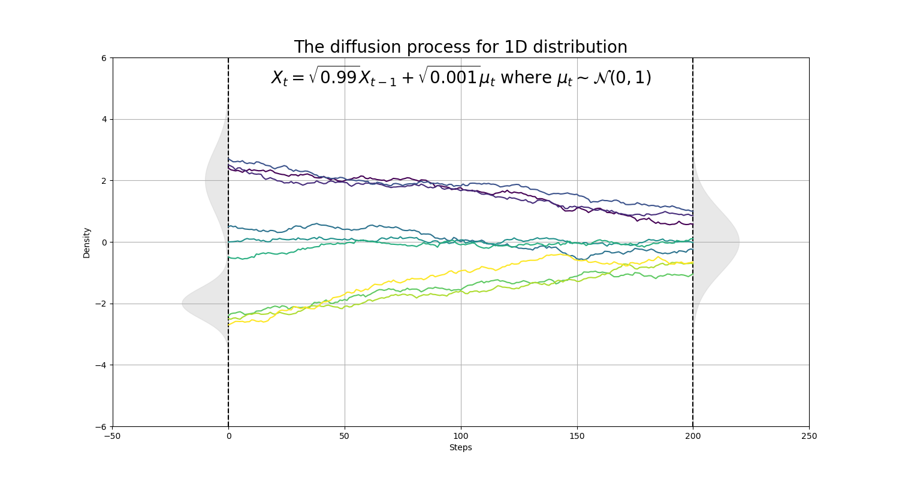

### Intro

I will explain how diffusion model works in this post.

#### Build intuition from 1D case
Diffusion model was proposed in 2020 in the paper [Denoising Probabilistic Diffusion Models(DDPM)](https://arxiv.org/abs/2006.11239) and has been shown to generate much better results than GAN. The diffusion model contains the forward process, which gradually destroy the information and the backward process that reverse the whole thing.  To explain how it works, let's start with a 1D exmaple. Let's say that we have input $X$ that follows some complex distribution, we can add gaussian noise $u_t$ to $X$ iteratively following this equation $X_t = \sqrt{1 - p} X_{t-1} + \sqrt{p} \mu_t$, where $\mu \sim \mathcal{N}(0, 1)$ and $p = 0.01$. As you can see that every step's output is a weighted average between the previous step and the gaussian noise. We can write down the final output after $T$ steps as follows:
$$
\begin{aligned}
X_T &= \sqrt{1 - p} X_{T-1} + \sqrt{p} \mu_t \\\
    &= \sqrt{1 - p} (\sqrt{1 - p} X_{T-2} + \sqrt{p} \mu_{T-1}) + \sqrt{p} \mu_t \\\
    &= \ldots \\\
    &= (\sqrt{1 - p})^T X_0 + \sum_{i=0}^{T-1} \sqrt{p}(\sqrt{1 - p})^{i} \mu_{T-i}
\end{aligned}
$$

When we have enough steps, T will approach infinity. And at this time, we will see that the first term above will approach zero($(\sqrt{1 - p})^T \xrightarrow[T \to \infty]{} 0$). For the second term, because we add independent gaussian noise at each step, we can sum up these the variances of all these gaussians together to get the final variance as:
$\sum_{i=0}^{T-1} p(1 - p)^{i} \mu_{T-i} = p \cdot \frac{1 - (1 - p)^T}{1 - (1 - p)} \xrightarrow[T \to \infty]{} 1$.
This means that if we have enough steps, we can convert any distribution $X$ to a standard normal distribution.

*
The diffusion process for 1d distribution(by Pu Zhang)
*

We can extend the same idea to higher dimension. For images of size 512 x 512, we can use diffusion process to gradually turn them into an 512 x 512 isotropic gaussian noise. For this high dimension case, we do the diffusion for each RGB channel of each pixel.

*
The diffusion process for images(by Pu Zhang)
*

We can use diffusion to transform any complex distribution into an isotropic gaussian distribution, but we are more interested in the reverse process, which is to transform the isotropic gaussian distribution into the unknown target distribution(usually the distribution where our input training data comes from). This is basically the diffusion model's high level idea: we train a model from the diffusion process and use the model to reverse the diffusion process. 

#### Mathmatical Derivation for Diffusion Model

The DDPM algorithm is illustrated in the picture below. DDPM models the diffusion process as a Markov process where we gradually add gaussian noise to the image. According to the Markov property, each step only depends on the previous step. So we can write the gaussian transition probability as $q(\textbf{x}\_t \vert \textbf{x}\_{t-1}) = \mathcal{N}(\textbf{x}\_t; \sqrt{1 - \beta\_t} \textbf{x}\_{t-1}, \beta\_t\textbf{I})$, this is also called the diffusion kernel. Similar to the 1D case, we can expand this iteration and represent $X_t$ using $X_0$ as follows:
$$
\begin{aligned}
\mathbf{x}\_t 
&= \sqrt{\alpha\_t}\mathbf{x}\_{t-1} + \sqrt{1 - \alpha\_t}\boldsymbol{\epsilon}\_{t-1} & \text{ ;where } \boldsymbol{\epsilon}\_{t-1}, \boldsymbol{\epsilon}\_{t-2}, \dots \sim \mathcal{N}(\mathbf{0}, \mathbf{I}) \\\
&= \sqrt{\alpha\_t \alpha\_{t-1}} \mathbf{x}\_{t-2} + \sqrt{1 - \alpha\_t \alpha\_{t-1}} \bar{\boldsymbol{\epsilon}}\_{t-2} & \text{ ;where } \bar{\boldsymbol{\epsilon}}\_{t-2} \text{ merges two Gaussians (*).} \\\
&= \dots \\\
&= \sqrt{\bar{\alpha}\_t}\mathbf{x}\_0 + \sqrt{1 - \bar{\alpha}\_t}\boldsymbol{\epsilon} \\\
\end{aligned}
$$
The reason why we can merge different gaussian together is similar to the 1D case where all of these gaussian are independent with each other. Now with this derived property, instead of doing the diffusion process step-by-step, we can compute the perturbed image at any step $X_t$ in one step, following this equation, which is much faster:
$q(\mathbf{x}\_t \vert \mathbf{x}\_0) = \mathcal{N}(\mathbf{x}\_t; \sqrt{\bar{\alpha}\_t} \mathbf{x}\_0, (1 - \bar{\alpha}\_t)\mathbf{I})$, where $\alpha\_t = 1 - \beta\_t$ and $\bar{\alpha}\_t = \prod\_{i=1}^{t} \alpha\_i$. 
And the probability for any given forward trajectory could be given by $q(x\_{0:T}) = q(x\_0)\prod\_{i=0}^{T} q(x\_t \vert x\_{t-1})$.    

*
The diffusion algorithm(by Pu Zhang)
*

With sufficiently small timesteps, we can approximate the reverse process as a Markov chain with gaussian transition probability. So we can use a neural network to approximate the reverse process $q(x_{t-1}\vert x_t)$. Let's denote the transition probability predicted by the model as $p\_\theta(x\_{t-1}\vert x\_t)=\mathcal{N}(x\_{t-1};\mu\_\theta(x_t, t), \Sigma_\theta (x\_t, t))$. 

We want the sampled data from gaussian noise after the reverse process to be as close to the target distribution as possible. In other words, we want $q(x_0)$ to be as close to $p_\theta(x_0)$ as possible. This can be achieved by optimizing for the KL divergence between $q(x_0)$ and $p_\theta(x_0)$. 

$$
\begin{aligned}
\mu\_\theta\^\*, \Sigma\_\theta\^\* &= \arg\min\_{\mu\_\theta, \Sigma\_\theta} \left( D\_{KL}(q(x\_0) \vert \| p\_\theta(x\_0)) \right) \\\
&=\arg\min\_{\mu\_\theta, \Sigma\_\theta}\left( -\int q(x\_0) log\left( \frac{p\_\theta(x\_0)}{q(x\_0)} \right) dx\_0 \right) \\\
&=\arg\min\_{\mu\_\theta, \Sigma\_\theta}\left( -\int q(x\_0) log\left( p\_\theta(x\_0) \right) dx\_0 \right)
\end{aligned}
$$
We can use the right hand side as the loss function for our training. Note that this is also the loss function when we want to maximize the log likelihood based on the estimated $p_\theta(x_0)$.
$p_\theta(x_0)$ can be got by starting from $x_T$ and integrate over all possible backward paths. In other words, $p_\theta(x_0) = \int p_\theta(x_{0:T})dx_{1:T}$. We can plugin the posterior distribution of the forward transition kernel into this equation to get $log(p_\theta(x_0)) = log \left( \int p_\theta(x_{0:T})dx_{1:T} \right) = log\left(\int \frac{p_\theta(x_{0:T})}{q(x_{1:T}\vert x_0)} q(x_{1:T}\vert x_0)dx_{1:T} \right)$. According to Jensen inequality, we have 
$$
log\left(\int \frac{p_\theta(x_{0:T})}{q(x_{1:T}\vert x_0)} q(x_{1:T}\vert x_0)dx_{1:T} \right) \ge \int log\left( \frac{p_\theta(x_{0:T})}{q(x_{1:T}\vert x_0)} \right) q(x_{1:T}\vert x_0)dx_{1:T} 
$$
So we can define an upper bound to the loss $L$:
$$
\begin{aligned}
L &= -\int q(x\_0)log\left(\int \frac{p\_\theta(x\_{0:T})}{q(x\_{1:T}\vert x\_0)} q(x\_{1:T}\vert x\_0)dx\_{1:T} \right) dx\_0 \\\
  &\le -\int q(x\_0) \left( \int log \left(\frac{p\_\theta(x\_{0:T})}{q(x\_{1:T}\vert x\_0)}\right) q(x\_{1:T}\vert x\_0)dx\_{1:T} \right) dx\_0\\\
  &\le -\int log\left( \frac{p\_\theta(x\_{0:T})}{q(x\_{1:T}\vert x\_0)} \right) q(x\_{0:T})dx\_{0:T} \\\
  &=\mathbb{E}\_{q(\mathbf{x}\_{0:T})}\left(-log \frac{p\_\theta(x\_{0:T})}{q(x\_{1:T}\vert x\_0)} \right) \\\
  & = \bar{L}
\end{aligned}
$$
Instead of optimizing $L$, we optimize $\bar{L}$.
$$
\small{
\begin{aligned}
\bar{L} &= \mathbb{E}\_{q(\mathbf{x}\_{0:T})}-\log\left( \frac{p\_\theta(x\_{0:T})}{q(x\_{1:T}\vert x\_0)} \right) \\\
&= \mathbb{E}\_{q(\mathbf{x}\_{0:T})} \left ( -\log\frac{p(x\_T)\prod\_{t=1}\^T p\_\theta(x\_{t-1} \vert x\_t)}{q(x\_1 \vert x\_0) \prod\_{t=2}\^T q(x\_t \vert x\_{t-1}, x\_0)} \right ) \\\
&= \mathbb{E}\_{q(\mathbf{x}\_{0:T})} \left ( -\log\frac{p(x\_T)\prod\_{t=1}\^T p\_\theta(x\_{t-1} \vert x\_t)}{q(x\_1 \vert x\_0) \prod\_{t=2}\^T \left( \frac{q(x\_{t-1} \vert x\_t, x\_0)q(x\_t \vert x\_0)}{q(x\_{t-1} \vert x\_0)} \right)} \right ) \\\
&= \mathbb{E}\_{q(\mathbf{x}\_{0:T})} \left ( -\log\frac{p(x\_T)\prod\_{t=1}\^T p\_\theta(x\_{t-1} \vert x\_t)}{q(x\_T \vert x\_0) \prod\_{t=2}\^T q(x\_{t-1\vert x\_t, x\_0})} \right ) \\\
&= \mathbb{E}\_{q(\mathbf{x}\_{0:T})} \left ( -\log\frac{p(x\_T)}{q(x\_T\vert x\_0)} - \sum\_{t=2}\^T \log \frac{p\_\theta(x\_{t-1}\vert x\_t)}{q(x\_{t-1}\vert x\_t, x\_0)} - \log p\_\theta(x\_0 \vert x\_1) \right) \\\
&= \mathbb{E}\_{q(\mathbf{x}\_{0:T})} \left ( D\_{KL}(q(x\_T\vert x\_0)\|p(x\_T)) + \sum\_{t=2}\^TD\_{KL}(q(x\_{t-1}\vert x\_t, x\_0)\| p\_\theta(x\_{t-1}\vert x\_t)) - \log p\_\theta(x\_0\vert x\_1) \right)
\end{aligned}}
$$

We can see that $\bar{L}$ can be expressed as three terms, the first term does not depend on the neutral network parameters $\theta$, we can minimize it by choosing large enough steps so that the final denoised data distribution follows an isotropic gaussian distribution. The last term is generally small, we can either ignore it or use a separate neutral network to represent it. The most important term is the second term, which could be expressed as the summation of a series of KL divergence. 

The posterior distribution for the diffusion kernel condition on $x_0$ has an analytical form:
$$
\scriptsize{
\begin{aligned}
q(x\_{t-1}\vert x\_t, x\_0) &= q(x\_t\vert x\_{t-1}, x\_0) \frac{q(x\_{t-1}\vert x\_0)}{q(x\_t \vert x\_0)} \\\
&\propto \exp\left( -\frac{1}{2}\left( \frac{(x\_t-\sqrt{\alpha\_t}x\_{t-1})\^2}{\beta\_t} + \frac{(x\_{t-1}-\sqrt{\bar{\alpha}\_{t-1}}x\_0)\^2}{1-\bar{\alpha}\_{t-1}} + \frac{(x\_t-\sqrt{\bar{\alpha}\_t}x\_0)\^2}{1-\bar{\alpha}\_t} \right ) \right) \\\
&= \exp\left( -\frac{1}{2}\left( \frac{x\_t\^2-2\sqrt{\alpha\_t}x\_t {\color{Green} x\_{t-1}} + \alpha\_t{\color{Red}  x\_{t-1}\^2}}{\beta\_t} + \frac{{\color{Red} x\_{t-1}\^2}-2\sqrt{\bar{\alpha}\_{t-1}}x\_0{\color{Green} x\_{t-1}} + \bar{\alpha}\_{t-1}x\_0\^2}{1-\bar{\alpha}\_{t-1}} + \frac{(x\_t-\sqrt{\bar{\alpha}\_t}x\_0)\^2}{1-\bar{\alpha}\_t} \right ) \right) \\\
&= \exp\left( \frac{1}{2}\left({\color{Red} (\frac{\alpha\_t}{\beta\_t} + \frac{1}{1-\bar{\alpha}\_{t-1}})x\_{t-1}\^2} - {\color{Green} (\frac{2\sqrt{\alpha\_t}}{\beta\_t}x\_t + \frac{2\sqrt{\bar{\alpha}\_{t-1}}}{1-\bar{\alpha}\_{t-1}}x\_0)x\_{t-1}} + C(x\_t, x\_0) \right)\right)
\end{aligned}}
$$
*
The posterior distribution for the diffusion kernel(by [Lilian Weng](https://lilianweng.github.io/posts/2021-07-11-diffusion-models/))
*

Let's denote:
$$
\hat{\beta\_t} = \frac{1}{(\frac{\alpha\_t}{\beta\_t} + \frac{1}{1-\bar{\alpha}\_{t-1}})}
=\frac{1}{\frac{\alpha\_t-\bar{\alpha}\_t+\beta\_t}{\beta\_t(1-\bar{\alpha}\_{t-1})}}
=\frac{1 - \bar{\alpha}\_{t-1}}{1-\bar{\alpha}\_t}\beta\_t
$$
$$
\begin{aligned}
\hat{\mu}\_t(x\_t, x\_0) &= \frac{\frac{\sqrt{\alpha\_t}}{\beta\_t}x\_t + \frac{\sqrt{\bar{\alpha}\_{t-1}}}{1-\bar{\alpha}\_{t-1}}x\_0}{(\frac{\alpha\_t}{\beta\_t} + \frac{1}{1-\bar{\alpha}\_{t-1}})}\\\
&=(\frac{\sqrt{\alpha\_t}}{\beta\_t}x\_t + \frac{\sqrt{\bar{\alpha}\_{t-1}}}{1-\bar{\alpha}\_{t-1}}x\_0)\frac{1 - \bar{\alpha}\_{t-1}}{1-\bar{\alpha}\_t}\beta\_t\\\
&=\frac{\sqrt{\alpha\_t}(1-\bar{\alpha}\_{t-1}))}{1-\bar{\alpha\_t}}x\_t+\frac{\sqrt{\bar{\alpha}\_{t-1}}\beta\_t}{1-\bar{\alpha\_t}}x\_0
\end{aligned}
$$
Then We have $q(x\_{t-1}\vert x\_t, x\_0) = \mathcal{N}(x\_{t-1}; {\color{Green} \hat{\mu}(x\_t, x\_0)}, {\color{Red} \hat{\beta\_t}I})$.

Recall that the most important terms for our loss upper bound is $\mathbb{E}\_{q(\mathbf{x}\_{0:T})} \left (\sum\_{t=2}\^TD\_{KL}(q(x\_{t-1}\vert x\_t, x\_0)\| p\_\theta(x\_{t-1}\vert x\_t)) \right)$.

---
