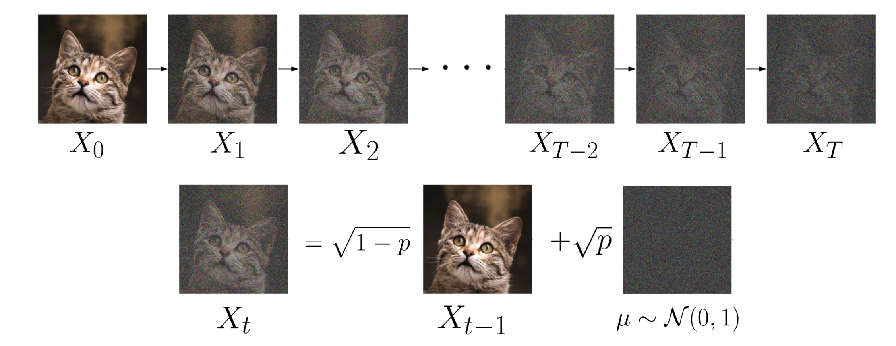

### The Rise of Diffusion Models

Recently, diffusion models have gained significant traction, evidenced by the rapidly expanding user base of platforms like stable diffusion, midjourney, and DALLE-2. In this article, I'll delve into the intricacies of how diffusion models operate. My aim is to present this content in a manner that minimizes the need for prior expertise in diffusion models or mathematics.

### Understanding Diffusion Models with a 1D Illustration

Introduced in 2020 through the paper titled [Denoising Probabilistic Diffusion Models(DDPM)](https://arxiv.org/abs/2006.11239), the diffusion model has demonstrated superior performance compared to GANs. This model comprises a forward process, which incrementally obliterates information, and a backward process that undoes these changes. To elucidate its workings, we'll commence with a 1D example. Suppose we have an input $X$ which adheres to a multifaceted distribution. We iteratively add Gaussian noise $u_t$ to $X$ following this equation $X_t = \sqrt{1 - p} X_{t-1} + \sqrt{p} \mu_t$, where $\mu \sim \mathcal{N}(0, 1)$ and $p = 0.01$. Observe that the output at each step is a weighted blend of the preceding step and Gaussian noise. The resulting output after $T$ steps can be expressed as:
$$
\begin{aligned}
X_T &= \sqrt{1 - p} X_{T-1} + \sqrt{p} \mu_t \\\
    &= \sqrt{1 - p} (\sqrt{1 - p} X_{T-2} + \sqrt{p} \mu_{T-1}) + \sqrt{p} \mu_t \\\
    &= \ldots \\\
    &= (\sqrt{1 - p})^T X_0 + \sum_{i=0}^{T-1} \sqrt{p}(\sqrt{1 - p})^{i} \mu_{T-i}
\end{aligned}
$$

As the number of steps increases and $T$ approaches infinity, the first term mentioned will converge to zero: $(\sqrt{1 - p})^T \xrightarrow[T \to \infty]{} 0$. For the second term, since we introduce independent Gaussian noise at every step, the final variance can be derived by summing the variances of all these individual Gaussians. It is given by:
$\sum_{i=0}^{T-1} p(1 - p)^{i} \mu_{T-i} = p \cdot \frac{1 - (1 - p)^T}{1 - (1 - p)} \xrightarrow[T \to \infty]{} 1$.
This implies that given a sufficient number of steps, we can transform any distribution $X$ into a standard normal distribution.

*
The diffusion process for 1d distribution(by Pu Zhang)
*

For images sized 512 x 512, the diffusion process can be applied to each RGB channel of every pixel, transforming them into isotropic Gaussian noise. While diffusion can be used to convert intricate distributions into isotropic Gaussian ones, our primary interest lies in its inverse: transitioning the isotropic Gaussian distribution back to the original target distribution, typically where our training data originates. In essence, the diffusion model's core concept involves training from the diffusion process and then utilizing the model to reverse it.

*
The diffusion process for images(by Pu Zhang)
*

### Decomposing the Markov Diffusion Process in DDPM

The DDPM algorithm, depicted below, models the diffusion process as a Markov sequence where Gaussian noise is progressively added to an image. Given the Markov property, each step relies solely on its predecessor. Thus, the Gaussian transition, also known as the diffusion kernel, is represented as $$q(\textbf{x}\_t \vert \textbf{x}\_{t-1}) = \mathcal{N}(\textbf{x}\_t; \sqrt{1 - \beta\_t} \textbf{x}\_{t-1}, \beta\_t\textbf{I})$$. Analogous to the 1D scenario, we can iteratively express $X_t$ using $X_0$:

$$
\begin{aligned}
\mathbf{x}\_t 
&= \sqrt{\alpha\_t}\mathbf{x}\_{t-1} + \sqrt{1 - \alpha\_t}\epsilon\_{t-1} & \text{ ;where } \epsilon\_{t-1}, \epsilon\_{t-2}, \dots \sim \mathcal{N}(\mathbf{0}, \mathbf{I}) \\\
&= \sqrt{\alpha\_t \alpha\_{t-1}} \mathbf{x}\_{t-2} + \sqrt{1 - \alpha\_t \alpha\_{t-1}} \bar{\epsilon}\_{t-2} & \text{ ;where } \bar{\epsilon}\_{t-2} \text{ merges two Gaussians (*).} \\\
&= \dots \\\
&= \sqrt{\bar{\alpha}\_t}\mathbf{x}\_0 + \sqrt{1 - \bar{\alpha}\_t}\epsilon \\\
\end{aligned}
$$

*The ability to combine different Gaussians is akin to the 1D scenario, given their independence.*

**For clarity in the LaTeX expressions, we will represent vectors with regular symbols instead of using bold font.**

Leveraging this property, instead of a sequential diffusion process, we can directly compute the perturbed image at any step $X_t$ using:
$$q(x\_t \vert x\_0) = \mathcal{N}(x\_t; \sqrt{\bar{\alpha}\_t} x\_0, (1 - \bar{\alpha}\_t)I) \quad \text{where} \quad \alpha\_t = 1 - \beta\_t \quad \text{and} \quad  \bar{\alpha}\_t = \prod\_{i=1}^{t} \alpha\_i$$. The probability of a given forward trajectory is denoted by $$q(x\_{0:T}) = q(x\_0)\prod\_{i=0}^{T} q(x\_t \vert x\_{t-1})$$.

*
The diffusion algorithm(by Pu Zhang)
*

### Loss Upper Bound for DDPM Models

Given small timesteps, the reverse process can be approximated as a Markov chain with Gaussian transition probability. We use a neural network to estimate the reverse process $q(x_{t-1}\vert x_t)$. We represent the model's predicted transition probability as 
$$p_\theta(x_{t-1}\vert x_t)=\mathcal{N}(x_{t-1};\mu_\theta(x_t, t), \Sigma_\theta (x_t, t))$$. Our goal is to have the data sampled from Gaussian noise after this reverse process align closely with the target distribution, which means minimizing the KL divergence between $q(x_0)$ and $p_\theta(x_0)$.

$$
\begin{aligned}
\mu\_\theta\^\*, \Sigma\_\theta\^\* &= \arg\min\_{\mu\_\theta, \Sigma\_\theta} \left( D\_{KL}(q(x\_0) \vert \| p\_\theta(x\_0)) \right) \\\
&=\arg\min\_{\mu\_\theta, \Sigma\_\theta}\left( -\int q(x\_0) log\left( \frac{p\_\theta(x\_0)}{q(x\_0)} \right) dx\_0 \right) \\\
&=\arg\min\_{\mu\_\theta, \Sigma\_\theta}\left( -\int q(x\_0) log\left( p\_\theta(x\_0) \right) dx\_0 \right)
\end{aligned}
$$
We can utilize the right-hand side as our training loss function. This is also the loss when maximizing the log likelihood with the estimated $p_\theta(x_0)$. Obtaining $p_\theta(x_0)$ involves starting from $x_T$ and integrating over all potential backward paths, so $$p_\theta(x_0) = \int p_\theta(x_{0:T})dx_{1:T}$$. By inserting the posterior distribution of the forward transition kernel, we find $$log(p_\theta(x_0)) = log\left(\int \frac{p_\theta(x_{0:T})}{q(x_{1:T}\vert x_0)} q(x_{1:T}\vert x_0)dx_{1:T} \right)$$.
Using the Jensen inequality, we obtain:
$$
log\left(\int \frac{p_\theta(x_{0:T})}{q(x_{1:T}\vert x_0)} q(x_{1:T}\vert x_0)dx_{1:T} \right) \ge \int log\left( \frac{p_\theta(x_{0:T})}{q(x_{1:T}\vert x_0)} \right) q(x_{1:T}\vert x_0)dx_{1:T} 
$$
This leads us to define an upper bound $\bar{L}$ for the loss $L$:
$$
\begin{aligned}
L &= -\int q(x\_0)log\left(\int \frac{p\_\theta(x\_{0:T})}{q(x\_{1:T}\vert x\_0)} q(x\_{1:T}\vert x\_0)dx\_{1:T} \right) dx\_0 \\\
  &\le -\int q(x\_0) \left( \int log \left(\frac{p\_\theta(x\_{0:T})}{q(x\_{1:T}\vert x\_0)}\right) q(x\_{1:T}\vert x\_0)dx\_{1:T} \right) dx\_0\\\
  &\le -\int log\left( \frac{p\_\theta(x\_{0:T})}{q(x\_{1:T}\vert x\_0)} \right) q(x\_{0:T})dx\_{0:T} \\\
  &=\mathbb{E}\_{q(\mathbf{x}\_{0:T})}\left(-log \frac{p\_\theta(x\_{0:T})}{q(x\_{1:T}\vert x\_0)} \right) \\\
  & = \bar{L}
\end{aligned}
$$
Rather than optimizing $L$, we focus on optimizing $\bar{L}$:
$$
\small{
\begin{aligned}
\bar{L} &= \mathbb{E}\_{q(\mathbf{x}\_{0:T})}-\log\left( \frac{p\_\theta(x\_{0:T})}{q(x\_{1:T}\vert x\_0)} \right) \\\
&= \mathbb{E}\_{q(\mathbf{x}\_{0:T})} \left ( -\log\frac{p(x\_T)\prod\_{t=1}\^T p\_\theta(x\_{t-1} \vert x\_t)}{q(x\_1 \vert x\_0) \prod\_{t=2}\^T q(x\_t \vert x\_{t-1}, x\_0)} \right ) \\\
&= \mathbb{E}\_{q(\mathbf{x}\_{0:T})} \left ( -\log\frac{p(x\_T)\prod\_{t=1}\^T p\_\theta(x\_{t-1} \vert x\_t)}{q(x\_1 \vert x\_0) \prod\_{t=2}\^T \left( \frac{q(x\_{t-1} \vert x\_t, x\_0)q(x\_t \vert x\_0)}{q(x\_{t-1} \vert x\_0)} \right)} \right ) \\\
&= \mathbb{E}\_{q(\mathbf{x}\_{0:T})} \left ( -\log\frac{p(x\_T)\prod\_{t=1}\^T p\_\theta(x\_{t-1} \vert x\_t)}{q(x\_T \vert x\_0) \prod\_{t=2}\^T q(x\_{t-1\vert x\_t, x\_0})} \right ) \\\
&= \mathbb{E}\_{q(\mathbf{x}\_{0:T})} \left ( -\log\frac{p(x\_T)}{q(x\_T\vert x\_0)} - \sum\_{t=2}\^T \log \frac{p\_\theta(x\_{t-1}\vert x\_t)}{q(x\_{t-1}\vert x\_t, x\_0)} - \log p\_\theta(x\_0 \vert x\_1) \right) \\\
&= \mathbb{E}\_{q(\mathbf{x}\_{0:T})} \left ( D\_{KL}(q(x\_T\vert x\_0)\|p(x\_T)) + \sum\_{t=2}\^TD\_{KL}(q(x\_{t-1}\vert x\_t, x\_0)\| p\_\theta(x\_{t-1}\vert x\_t)) - \log p\_\theta(x\_0\vert x\_1) \right)
\end{aligned}}
$$

$\bar{L}$ consists of three terms. The first term, independent of the neural network parameters $\theta$, can be minimized by selecting sufficiently large steps, ensuring the final denoised data distribution resembles an isotropic gaussian distribution. While the last term is typically negligible, it can be represented using a distinct neural network if desired. The second term, the most significant, can be articulated as a sum of KL divergences.

The posterior distribution of the diffusion kernel, given $x_0$, is defined analytically as:

$$
\scriptsize{
\begin{aligned}
q(x\_{t-1}\vert x\_t, x\_0) &= q(x\_t\vert x\_{t-1}, x\_0) \frac{q(x\_{t-1}\vert x\_0)}{q(x\_t \vert x\_0)} \\\
&\propto \exp\left( -\frac{1}{2}\left( \frac{(x\_t-\sqrt{\alpha\_t}x\_{t-1})\^2}{\beta\_t} + \frac{(x\_{t-1}-\sqrt{\bar{\alpha}\_{t-1}}x\_0)\^2}{1-\bar{\alpha}\_{t-1}} + \frac{(x\_t-\sqrt{\bar{\alpha}\_t}x\_0)\^2}{1-\bar{\alpha}\_t} \right ) \right) \\\
&= \exp\left( -\frac{1}{2}\left( \frac{x\_t\^2-2\sqrt{\alpha\_t}x\_t {\color{Green} x\_{t-1}} + \alpha\_t{\color{Red}  x\_{t-1}\^2}}{\beta\_t} + \frac{{\color{Red} x\_{t-1}\^2}-2\sqrt{\bar{\alpha}\_{t-1}}x\_0{\color{Green} x\_{t-1}} + \bar{\alpha}\_{t-1}x\_0\^2}{1-\bar{\alpha}\_{t-1}} + \frac{(x\_t-\sqrt{\bar{\alpha}\_t}x\_0)\^2}{1-\bar{\alpha}\_t} \right ) \right) \\\
&= \exp\left( \frac{1}{2}\left({\color{Red} (\frac{\alpha\_t}{\beta\_t} + \frac{1}{1-\bar{\alpha}\_{t-1}})x\_{t-1}\^2} - {\color{Green} (\frac{2\sqrt{\alpha\_t}}{\beta\_t}x\_t + \frac{2\sqrt{\bar{\alpha}\_{t-1}}}{1-\bar{\alpha}\_{t-1}}x\_0)x\_{t-1}} + C(x\_t, x\_0) \right)\right)
\end{aligned}}
$$
*
The posterior distribution for the diffusion kernel(by [Lilian Weng](https://lilianweng.github.io/posts/2021-07-11-diffusion-models/))
*

Consider the following definitions:
$$
\hat{\beta\_t} = \frac{1}{(\frac{\alpha\_t}{\beta\_t} + \frac{1}{1-\bar{\alpha}\_{t-1}})}
=\frac{1}{\frac{\alpha\_t-\bar{\alpha}\_t+\beta\_t}{\beta\_t(1-\bar{\alpha}\_{t-1})}}
=\frac{1 - \bar{\alpha}\_{t-1}}{1-\bar{\alpha}\_t}\beta\_t
$$
$$
\begin{aligned}
\hat{\mu}\_t(x\_t, x\_0) &= \frac{\frac{\sqrt{\alpha\_t}}{\beta\_t}x\_t + \frac{\sqrt{\bar{\alpha}\_{t-1}}}{1-\bar{\alpha}\_{t-1}}x\_0}{(\frac{\alpha\_t}{\beta\_t} + \frac{1}{1-\bar{\alpha}\_{t-1}})}\\\
&=(\frac{\sqrt{\alpha\_t}}{\beta\_t}x\_t + \frac{\sqrt{\bar{\alpha}\_{t-1}}}{1-\bar{\alpha}\_{t-1}}x\_0)\frac{1 - \bar{\alpha}\_{t-1}}{1-\bar{\alpha}\_t}\beta\_t\\\
&=\frac{\sqrt{\alpha\_t}(1-\bar{\alpha}\_{t-1}))}{1-\bar{\alpha\_t}}x\_t+\frac{\sqrt{\bar{\alpha}\_{t-1}}\beta\_t}{1-\bar{\alpha\_t}}x\_0
\end{aligned}
$$
Given these, the distribution is represented as $q(x\_{t-1}\vert x\_t, x\_0) = \mathcal{N}(x\_{t-1}; {\color{Green} \hat{\mu}(x\_t, x\_0)}, {\color{Red} \hat{\beta\_t}I})$.

With the relation $x_0 = \frac{1}{\sqrt{\bar{\alpha}_t}}(x_t - \sqrt{1 - \bar{\alpha}_t}\epsilon_t)$, the mean transforms as:
$$
\begin{aligned}
\hat{\mu}\_t(x_t, x_0)
&= \frac{\sqrt{\alpha\_t}(1 - \bar{\alpha}\_{t-1})}{1 - \bar{\alpha}\_t} \mathbf{x}\_t + \frac{\sqrt{\bar{\alpha}\_{t-1}}\beta\_t}{1 - \bar{\alpha}\_t} \frac{1}{\sqrt{\bar{\alpha}\_t}}(\mathbf{x}\_t - \sqrt{1 - \bar{\alpha}\_t}\epsilon\_t) \\\
&= \frac{1}{\sqrt{\alpha\_t}} \left( x\_t - \frac{1 - \alpha\_t}{\sqrt{1 - \bar{\alpha}\_t}} \epsilon\_t \right)
\end{aligned}
$$
This illustrates that the mean can be expressed in terms of the introduced error.

Consider the crucial term in our loss upper bound, $\mathbb{E}\_{q(\mathbf{x}\_{0:T})} \left (\sum\_{t=2}\^TD\_{KL}(q(x\_{t-1}\vert x\_t, x\_0)\| p\_\theta(x\_{t-1}\vert x\_t)) \right)$. Given that both $q$ and $p_\theta$ are Gaussian, their KL divergence can be analytically determined.

### KL Divergence Between Two Gaussian Distributions

Consider two Gaussian distributions, $p$ and $q$, having the same covariance matrices:

$$
\begin{align*}
\log q(x) &= -\frac{1}{2} \left( (x - \hat{\mu})^T \Sigma^{-1} (x - \hat{\mu}) \right) \\\
\log p(x) &= -\frac{1}{2} \left( (x - \mu_\theta)^T \Sigma^{-1} (x - \mu_\theta) \right) \\\
\log q(x) - \log p(x) &= -\frac{1}{2} \left( (x - \hat{\mu})^T \Sigma^{-1} (x - \hat{\mu}) - (x - \mu_\theta)^T \Sigma^{-1} (x - \mu_\theta) \right) \\\
&= -\frac{1}{2} \left( x^T \Sigma^{-1} x - 2x^T \Sigma^{-1} \hat{\mu} + \hat{\mu}^T \Sigma^{-1} \hat{\mu} \right) \\\
&+ \frac{1}{2} \left( x^T \Sigma^{-1} x - 2x^T \Sigma^{-1} \mu_\theta + \mu_\theta^T \Sigma^{-1} \mu_\theta \right) \\\
&= x^T \Sigma^{-1} (\mu_\theta - \hat{\mu}) - \frac{1}{2} \left( \mu_\theta^T \Sigma^{-1} \mu_\theta - \hat{\mu}^T \Sigma^{-1} \hat{\mu} \right)
\end{align*}
$$

Consider that the expectation of ${x_T}$ under $q(x)$ is given by ${\hat{\mu}^T}$, and $\Sigma = \hat{\beta}_tI$. Using these, we can plug into the KL divergence:

$$
\begin{align*}
D\_{KL}(q||p) &= \int q(x) \log \left( \frac{q(x)}{p(x)} \right) dx \\\
&= \int q(x) \left( \log q(x) - \log p(x) \right) dx \\\
&= \int q(x) \left( x^T \Sigma^{-1} (\mu\_\theta - \hat{\mu}) - \frac{1}{2} \left( \mu\_\theta^T \Sigma^{-1} \mu\_\theta - \hat{\mu}^T \Sigma^{-1} \hat{\mu} \right) \right) dx \\\
&= \hat{\mu}^T \Sigma^{-1}(\mu\_\theta-\hat{\mu}) -\frac{1}{2} \left( \mu\_\theta^T \Sigma^{-1} \mu\_\theta - \hat{\mu}^T \Sigma^{-1} \hat{\mu} \right) \\\
&= -\frac{1}{2\hat{\beta}\_t}\left( \hat{\mu}\_T\hat{\mu} + \mu\_\theta^T\mu\_\theta - 2 \hat{\mu}^T\mu\_\theta \right) \\\
&= -\frac{1}{2\hat{\beta}\_t} \left( \\| \hat{\mu} - \mu\_\theta  \\|^2 \right)
\end{align*}
$$

### Simplified Loss Equation for DDPM Models

We aim to minimize the L2 distance between the means of two Gaussian distributions. Initially, our goal is for $\mu\_\theta(x\_t, t)$ to approximate $\hat{\mu}(x\_t, x\_0)$, given by $ \frac{1}{\sqrt{\alpha\_t}} \left( x\_t - \frac{1 - \alpha\_t}{\sqrt{1 - \bar{\alpha}\_t}} \epsilon\_t \right) $. Instead of directly predicting $ \hat{\mu}(x\_t, x\_0) $, the model can be reformulated to estimate $ \epsilon\_t $. Thus, $ \mu\_\theta(x\_t, t) = \frac{1}{\sqrt{\alpha\_t}} \left( x\_t - \frac{1 - \alpha\_t}{\sqrt{1 - \bar{\alpha}\_t}} \epsilon\_\theta(x\_t, t) \right) $. Through this reparameterization, our model focuses on predicting errors.

The loss could be simplied to $$.

---
