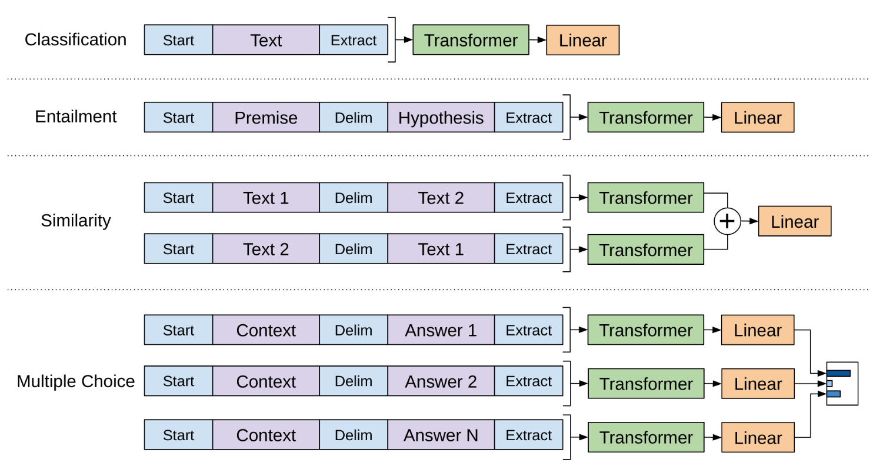

### Intro

Recently, ChatGPT has gained siginificant attention, with some drawing parallels to the invention of the internet. In this article, I will dive deep into the principles of GPT, from its first to third iterations, using the three famous papers about GPT as references:
- GPT-1: [Improving Language Understanding by Generative Pre-Training](https://s3-us-west-2.amazonaws.com/openai-assets/research-covers/language-unsupervised/language_understanding_paper.pdf)
- GPT-2: [Language Models are Unsupervised Multitask Learners](https://d4mucfpksywv.cloudfront.net/better-language-models/language_models_are_unsupervised_multitask_learners.pdf)
- GPT-3: [Language Models are Few-Shot Learners](https://arxiv.org/abs/2005.14165)

All these GPT versions share the similar architecture as transformers. For details on transformers, you can refer to [my earlier article]( "Transformers").

### GPT-1

#### Architecture

Now, we can talk about GPT. Let's first start with the first version of GPT, GPT-1. This serves as the foundation to subsequent iterations of GPT. The GPT acronym actually comes from generative pre-training and generative pre-training is basically a self-supervised learning technique.

This is the setup of GPT-1. 

*

*
*
GPT-1 Setup(by Pu Zhang)
*

The main point of gpt-1 was the idea of self-supervised learning so we pre-trained the model on 7000 books first and then use the understanding of the language learned to fine-tune it for certain tasks. This kind of self-supervised learning allows us to not use lots of label data and not train the model for every specific task separately. We just pre-train once and then fine-tune separately. Usually fine-tuning has much low-cost compared with pre-training.

This is how the GPT-1 architecture looks like. 
*

*
*
GPT-1 Architecture(by Pu Zhang)
*

We use the text and position embeddings as the input to the model, we then get the masked multi-head attention with residual connection over there, we then got layer normalization and then feed forward module which has two linear transformations and then we got another residual connection and layer normalization. We have 12 such submodules in total. In the end as you can see here, we've got two heads: one is for text prediction where we try to predict the next word given the previous k-words in context and the other one is for task classifier where we try to predict the correct label for specific tasks.

More formally, for the first text prediction head, we try to maximize the conditional probability for next word given the previous k context words using maximum likelihood estimation. The loss is $L_1(\mathcal{U}) = \sum\limits_i \log P(u_i\vert u_{i-k},\dots,u_{i-1};\mathcal{\Theta})$.

For the second task classifier head, given m input tokens, we try to predict the label for the input. So for sentiment analysis case, we try to minimize the binary cross entropy loss as an example. The loss is $L_2(\mathcal{C})=\sum\limits_{(x, y)}\log P(y\vert x^1, \dots, x^m)$.

The final loss is a weighted sum of these two losses: $L_3(\mathcal{C}) = L_2(\mathcal{C}) + \lambda * L_1(\mathcal{C})$

#### Measurement

After pre-training, the author fine-tuned the model on different tasks and tested its performance. 

*

*
*
GPT-1 Measurement(by Pu Zhang)
*

For classification tasks, the setup is straightforward, we just need to send the whole text as input to the transformer. 

For some other tasks like entailment, similarity and multiple choice questions, we need some additional adjustments. Specifically, for entailment, which means that we want to know whether one sentence is the logical sequence of another sentence or not. The model needs to output entailment, contradict or neutral depending on the logical relationship between the two sentences. For this task, the author proposed to concatenate the premise and hypothesis together and then send to the transformer. For similarity checking, the author proposed to concatenate the two sentences together in both directions, send the two sequences to the transformer and then add the output together before going through a linear connection. This reflects that similarity is symmetric.

For multiple choice questions, the author proposed to concatenate the question or context with each answer, send the result to the transformer and then like in the softmax setup, calculate the scores for each answer and choose the one with the highest score as the output.

#### Tokenization

Now, let's talk about one important preprocessing step in GPT-1, which is tokenization. Tokenization will split the input text sentences into tokens. And the GPT-1 process tokens instead of the raw text. There are three kinds of common tokenization methods in NLP: word based, character based and sub-word based. Word based basically splits the sentence into words, and it gives a large vocabulary, but may have lots of out-of-vocabulary cases, because there are way more words in English than in the training data. For character based tokenization, it splits the text into letters, and the vocabulary size is the same as the distinct number of letters. So there are fewer out-of-vocabulary cases. But each token does not have any real meaning and may not be that useful. Sub-word tokenization is a combination of the two, with the advantages of both. 

Byte Pair Encoding is such a tokenization algorithm, and it works as follows.

*

*
*
GPT-1 Byte Pair Encoding(by Pu Zhang)
*

Initially we set the vocabulary as all the english letters, which is 26. Then we process the input word by word, the input word student will first be split into adjacent letter pairs, and we count the histogram of it. Then the next word comes in, which is understand, again, we compute the adjacent pairs and their histogram. We merge this histogram with the previous histogram. We continue in this fashion until we finish processing all words. Then we choose the top-k pairs based on frequency. Here our top-2 pairs are s,t and d,e. Then we merge these two pairs and add them into the vocabulary. So now our vocabulary will have 26+2 tokens. We continue this until the size of the vocabulary reaches our desired threshold.

Let's go to the measurement part of GPT-1. In [the paper](https://s3-us-west-2.amazonaws.com/openai-assets/research-covers/language-unsupervised/language_understanding_paper.pdf), the author shows that GPT-1 can achieve new state-of-the-art results in 9 out of the 12 datasets they evaluate on. 

*

*
*
GPT-1 Evaluation Metrics(by Pu Zhang)
*

The left graph here is interesting. The authors notice that during fine-tuning, as we increase the number of layers that are frozen from pre-training, the model's performance on the fine-tuning tasks increases as well. This means that most of the layers learned from pre-training are useful for these tasks the model is not trained on.
And the right graph shows that as we increase the number of pre-training updates, the model's zero-shot performance on specific tasks also increases. 

### GPT-2

Let's move on to GPT-2. The core idea of GPT-2 is that by using more training data and larger models, GPT can achieve good zero-shot performance, beating the state-of-the-art task specific models on many tasks. Because the setup is zero-shot, you can see that we removed the fine-tuning case, and directly apply the pre-trained model on different tasks.

*

*
*
GPT-2 Setup(by Pu Zhang)
*

In [this paper](https://d4mucfpksywv.cloudfront.net/better-language-models/language_models_are_unsupervised_multitask_learners.pdf), the author crawled all outbound links from Reddit, after data cleaning, they got more than 40GB of text data as training data. So the training data volume is much larger than GPT-1 where we use 7000 books. GPT-2 uses almost the same model architecture as GPT-1. They just increase the number of submodules and adjust some hyperparameters. Overall, GPT-2 has 10 times more parameters compared with GPT-1.

So, that's it for all GPT-2's explanation. After training the model, the authors tested the model's performance on a variety of tasks in a zero-shot fashion, which means that they do not fine-tune the model but directly apply the pre-trained model on these different tasks. 
The first task is called the lambda dataset. The lambda dataset is testing the model's ability to find the long-term dependencies. For each data point, it has a context that is the text from the book, a target sentence and the model needs to predict the last word of the sentence. GPT-2 achieved state-of-the-art result in terms of perplexity.

*

*
*
GPT-2 Lambda Dataset(by Pu Zhang)
*

The next dataset is called CBT dataset. The CBT dataset is short for children book tests. CBT tests the model's ability to understand the language. Similarly, we have a context, a query that contains a blank and 10 candidates to fill the blank, and the model will output one choice out of the 10 candidate answers. gpt-2 also achieves state-of-the-art results on this dataset.

*

*
*
GPT-2 CBT Dataset(by Pu Zhang)
*

The authors also tested the model's performance on wikipedia datasets and webtext datasets. But most of these mentioned datasets are still quite fit to the language modeling setting, that is to predict the next word given context. So they are not that challenging.

But the paper also tests gpt-2 on a quite different task, which is the Winograd Schema Challenge. A Winograd schema is on a pair of sentences that diff in only one or two words. These two sentences contain an ambiguity that can be resolved in opposite ways. Resolving the ambiguity requires the use of world knowledge and reasoning.

*

*
*
GPT-2 Winograd Schema Challenge(by Pu Zhang)
*

For example, for this particular sentence, different verbs may cause the word they to represent different meanings. For example, if the verb is `feared`, then `they` should refer to the city council; if the verb is `advocated` then `they` should refer to the demonstrators. once again, gpt-2 achieved the state-of-the-art performance. The testing on this dataset is more interesting than just the language modeling tasks.

*

*
*
GPT-2 Datasets(by Pu Zhang)
*

CoQA dataset tests the model's reading comprehension ability. gpt-2 matches or exceeds the performance of task-specific models on three out of 4 tasks. 

The next task they tested the model on was on summarization task, so they asks the model to add TLDR to the end of the article. The results are mixed: some of the summaries are good but some others may contain confusing details like how many cars are involved in the crash, it could be reporting 8 cars, but the real number is 6.

For language translation tasks, gpt-2 only got 5 BLEU points, which means that gpt-2 is basically useless for language translation tasks. The performance here is really bad.

### GPT-3

Remember that we use fine-tuning for GPT-1, where we pre-train the language model and then fine-tune it on specific tasks. In GPT-2, we use much larger model and training data, the pre-trained model's performance is better, and we directly apply the model on specific tasks without pre-training. This is called zero-shot learning. If we add more example from each task as the model's input, it can help the model's performance on these different tasks. This is called one-shot learning. If we add several examples from each task as the additional model's input, it can further boost the pre-trained model's performance on different tasks. This is called few-shot learning. 

GPT-3 is using few-shot learning. That means that the pre-trained model is not fine-tuned on different tasks, but just use the examples from these different tasks as additional input. 
Okay, that's all what is novel in GPT-3. For the rest, it has the same architecture as GPT-2. But just has more parameters and more training data. 

The comparison between GPT-1, GPT-2 and GPT-3 is listed in the table below.

*

*
*
GPT-1/GPT-2/GPT-3 Comparison(by Pu Zhang)
*

As you can see here, GPT-2 has 10 times more parameters than GPT-1, while GPT-3 has 10 times more parameters than GPT-2. The number of training data increases dramatically from version 1 to version 3, so does the batch size. The basic model architecture stays the same, but we increase the number of submodules, from 12 submodules in GPT-1, all the way to 96 submodules in GPT-3. 

### Is GPT really intelligent?

Does it think like what humans do? After learning its principles, you may say no. It's basically predicting the next word given the context in many ways or it might just memorize the training data. To test this hypothesis, some researchers does some interesting experiments. 

The researchers ask GPT to give the code to draw a unicorn. And GPT does this perfectly. 

*

*
*
GPT Simple Drawing(by Pu Zhang)
*

Then the researchers altered the drawing code to move the body parts a bit and removed the horn. Then the researchers asked GPT to add code to put the horn back. 

*

*
*
GPT Complex Drawing(by Pu Zhang)
*

And GPT did it perfectly. The training data for this version of GPT does not contain any images, but GPT somehow could figure out the exact location of the horn and finish the task. This means that GPT learns something more than just the next word prediction, instead, it learns the structure of a unicorn.

The debate like this is still ongoing as of today.

---
