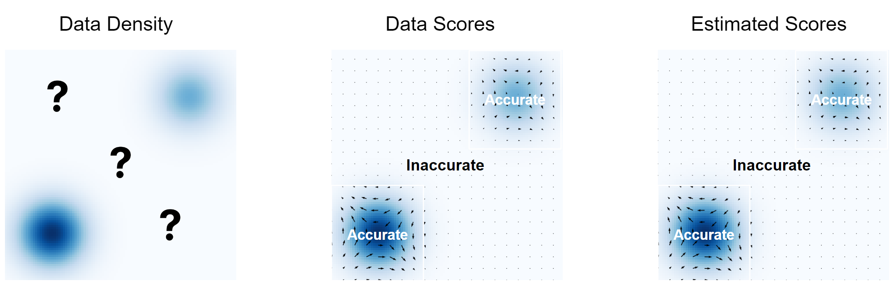
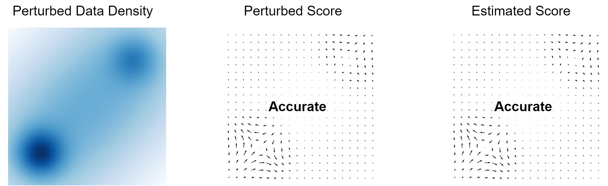
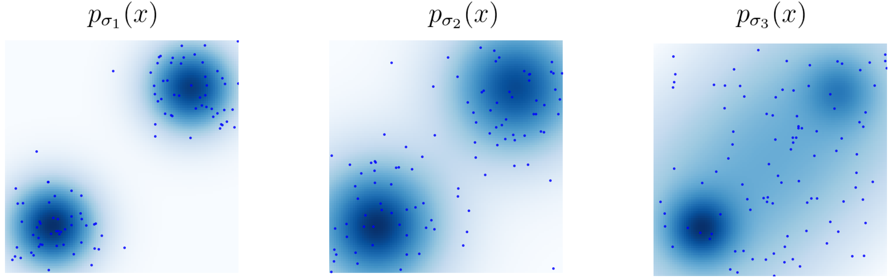
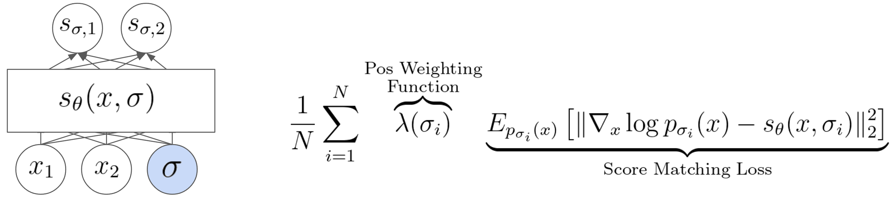

### Intro

In the ever-evolving landscape of image generation models, diffusion-related approaches have surged in popularity, accompanied by other notable advancements. Models like [Stable Diffusion](https://stability.ai/blog/stable-diffusion-public-release), [Imagen](https://imagen.research.google/), and [DALL-E2](https://openai.com/dall-e-2) have captured attention for their remarkable capabilities. In this post, I will show how the score based generative models are related to all these state-of-art generative models. The discussion here will encompass a comparative analysis of diffusion models with score-based generative models, showcasing how diffusion techniques can be effectively incorporated into the score-based framework. Additionally, I will explore intriguing possibilities where classifiers can guide the diffusion process, allowing for the generation of image samples based on specific class labels or textual inputs. After reading through the post, you will have a preliminary understanding of the principles behind these cutting-edge techniques and their potential applications in various fields. Many of the illustrations and equations listed here come from [this post](https://yang-song.net/blog/2021/score/) written by the primary author of the score-based generative model paper.

### Generative Model History

In the domain of machine learning, models fall into two main categories: generative and discriminative. A model that determines whether an image shows a dog or a cat is discriminative, whereas a model that generates a lifelike image of a dog or cat is generative. Representative discriminative models include Logistic regression, SVM, random forest, and DNN. On the other hand, typical generative models consist of autoencoders, GANs, and diffusion models.

The underlying principle for all generative models is to transform a basic distribution, commonly a gaussian distribution, into a more complex target distribution. This transformation simplifies the task of drawing samples from the complex distribution to merely sampling from a gaussian distribution. As an illustration, if we have a set of images, the distribution from which our image dataset originates can serve as the target distribution. To put it more precisely, if our basic gaussian distribution is denoted as $X$, our objective is to devise a model such that $G(X)$ mirrors the distribution of our input dataset. Consequently, when we draw samples from $X$, $G(X)$ will reflect the distribution of our original data.

#### Autoencoder
Autoencoders represent an early popular generative model. They comprise two components: an encoder, which transforms input data into a latent space, and a decoder, which reverts this latent representation back to an output resembling the original input data. One can also interpret autoencoders as dimensionality reduction techniques, given that the latent space typically has significantly fewer dimensions than the input. This latent space acts as the architecture's bottleneck, ensuring only the most import information is passed through and subsequently reconstructed. However, traditional autoencoders encode input data to arbitrary locations in the latent space, complicating the generation of realistic images upon decoding from sampled latent points. To address these limitations, the Variational Autoencoder (VAE) was introduced.

The VAE's innovation is its attempt to ensure encoded data within the latent space adheres to a standard normal distribution. This is accomplished by incorporating a KL-divergence between the encoded data and a standard normal distribution into the loss function. Thus, the loss consists of two components: a reconstruction loss (typically MSE, as with traditional autoencoders) and a KL-divergence loss. The resulting encoded data then aligns with a standard normal distribution. Such an approach guarantees that: 1) closely situated points in the latent space produce similar decoding outputs, and 2) any point sampled from the standard normal distribution yields meaningful decoded outputs. Nonetheless, the VAE often produces somewhat blurred results, likely due to inherent interpolations between various images.

*
Autoencoder architecture(by Pu Zhang)
*

#### GAN
Generative Adversarial Networks (GANs) are a renowned class of generative models, characterized by the interplay between two main components: the generator and the discriminator. Introduced in 2014, the generator uses random noise to produce lifelike images, while the discriminator's role is to distinguish between fake images crafted by the generator and authentic ones. The loss function for the discriminator is the BCE loss, whereas the generator's loss aims to maximize the log likelihood across all fabricated samples. For optimal image generation with GANs, both the generator and the discriminator must be proficient by the end of training. Over the past decade, GANs have demonstrated the capability to create strikingly realistic images, marking a significant milestone in deep learning. However, they come with two primary challenges: 1) the complexity of training the model, and 2) potential mode collapse issues, causing the generated images to lack diversity, meaning the model may only replicate a narrow segment of the input data distribution, rather than its entirety.

*
GAN architecture(by Pu Zhang)
*

#### Diffusion Model
The diffusion model, introduced in 2020, outperforms GAN in generating results. For an in-depth understanding of the diffusion model's functionality, please consult [my earlier article]( "Diffusion Model").

### Score Based Generative Models

In generative modeling, the goal is to mirror the complex distribution of real data. Using a deep neural network (DNN) is a natural strategy to achieve this. The intention is to utilize the DNN to model a complex probability distribution $P_\theta$. Nevertheless, the DNN's output $f_\theta$ doesn't directly reflect a distribution as it might not be positive everywhere. Therefore, our initial action is to exponentiate the output. Subsequently, to ensure the output ranges between 0 and 1 as a true probability distribution, the output is normalized by dividing with a constant $Z_\theta$. This constant in the denominator is called the normalizing constant. In Gaussian models, for example, determining this constant is straightforward due to the simplistic nature of $f_\theta$. However, for other advanced deep neural network architectures, it becomes a challenge to compute this constant.

*
Model Normalization Challenge(by Pu Zhang)
*

The primary concept of the [score based generative modeling paper](https://arxiv.org/abs/2011.13456) revolves around score functions. The picture below represents a density function alongside the score function for a combination of two Gaussian distributions. The density function is visually represented with varying shades, with a darker shade signifying a denser region. The score function, on the other hand, represents a vector field indicating the direction of the steepest increase in the density function. Given the density function, deducing the score function becomes straightforward by merely computing the derivative. Similarly, knowing the score function enables the retrieval of the density function, essentially, by calculating integrals. Hence, the score function and the probability distribution are interchangeable in their roles.

*
Score Function vs Probability Density(by Pu Zhang)
*

Revisiting the challenge related to the normalizing constant, it becomes evident that when the gradient of the probability function is computed, the normalization constant turns to zero because it does not rely on the variable $x$ in question.
$$
\begin{aligned}
\nabla_x \log p_\theta(x) &= \nabla_x f_\theta(x) - \nabla_x \log Z_\theta \\\
&= \nabla_x f_\theta(x) \\\
&= s_\theta(x)
\end{aligned}
$$

#### Score Matching

Instead of using a DNN to represent $p_\theta(x)$, we utilize the DNN to model the score function $s_\theta(x)$. The goal now shifts to contrasting two vector fields associated with score functions. Subsequently, we can determine the disparity vectors for those vector pairs. Finally, by averaging over the densities of these disparity vectors, we derive a singular scalar-valued objective. This technique is recognized as the score matching algorithm.

*
Score Matching Algorithm(by Pu Zhang)
*

In the score matching algorithm, we are given a set of samples from our input data distribution $$\{x_1, x_2, \dots, x_N\} \overset{\text{i.i.d.}}{\sim} p_{\text{data}}(x)$$. We want to use a score model $s_\theta(x)$ to estimate the score function of the input data distribution $$\nabla_x \log p_{\text{data}}(x)$$. To compare two vector fields of scores, our objective function is $$\frac{1}{2}E_{p_{\text{data}(x)}}\left[\\| \nabla_x \log p_{\text{data}}(x) - s_\theta(x) \\|\right]$$. This equation could be rewritten to not depend on $\nabla_{x}\log p_{data}(x)$ following integration by parts. To show how it works, let's use an 1D example for simplicity. 
$$
\begin{aligned}
-\int p(x) \nabla\_x \log p(x) s\_\theta(x) dx &= -\int p(x) \frac{\nabla\_x p(x)}{p(x)} s\_\theta(x) dx \\\
&= - \int \nabla\_x p(x) s\_\theta(x) dx \\\
&= -p(x) s\_\theta(x)\Big|\_{x=-\infty}^\infty + \int p(x) \nabla\_x s\_\theta(x) dx \\\
&= \int p(x) \nabla_x s_{\theta}(x) dx
\end{aligned}
$$
The last step for derivation holds because for most common probability density functions(pdfs), the value of the pdf approaches zero as $x$ approaches $\pm \infty$, so we have 
$$
\begin{aligned}
p(x) s\_\theta(x)\Big|\_{x=-\infty}^\infty &= p(\infty)s_\theta(\infty) - p(-\infty)s_\theta(-\infty) \\\
&= 0 \times s_\theta(\infty) - 0 \times s_\theta(-\infty) \\\
&= 0
\end{aligned}$$.
Plugin this into the objective of score matching, we have
$$
\begin{aligned}
\frac{1}{2}\left[ (\nabla_x \log p(x) - s_\theta(x))^2\right] &= \frac{1}{2}\int p(x)(\nabla_x \log p(x))^2 dx + \frac{1}{2}\int p(x)s_\theta(x)^2 dx \\\
                                                              &- \int p(x) \nabla_x \log p(x) s_\theta(x) dx \\\
                                                              &= {\color{Blue} \frac{1}{2}\int p(x)(\nabla_x \log p(x))^2 dx} + {\color{Orange} \frac{1}{2}\int p(x)s_\theta(x)^2 dx} \\\
                                                              &+ {\color{Green} \int p(x) \nabla_x s_{\theta}(x) dx}  \\\
                                                              &= {\color{Blue} \text{const}} + {\color{Orange} \frac{1}{2}E_{p(x)}[s_\theta(x)^2]} + {\color{Green} E_{p(x)} [\nabla_x s_{\theta}(x)]}
\end{aligned}
$$
The blue part above is constant because it does not depent on $\theta$. This illustration is in 1D case, in general, we have
$$
\small{
\begin{aligned}
\arg\min_{\theta} \frac{1}{2}E_{p_{\text{data}(x)}}[\\| \nabla_x \log p_{\text{data}}(x) - s_\theta(x) \\|] &= \arg\min_{\theta} E_{p_{data}(x)}\left[\frac{1}{2}\\| s_\theta(x) \\|^2 + \text{trace} ( \nabla_x s_\theta(x)) \right] \\\
                                                                                          &\approx \arg\min_{\theta} \frac{1}{N} \sum_{i=1}^N \left[\frac{1}{2}\\| s_\theta(x) \\|^2 + \text{trace} ( \nabla_x s_\theta(x))\right]
\end{aligned}
}
$$

#### Langevin Dynamics

After determining the estimated score function, we must devise a method to construct our generative model by generating new data points from the given vector field of score functions. A potential strategy is to shift these points according to the directions suggested by the score function. Nevertheless, this won't yield valid samples as the points will ultimately converge. This challenge can be circumvented by adhering to a noisy rendition of the score function. In essence, we aim to introduce Gaussian noise into our score function and pursue those noise-distorted score functions. This technique is widely recognized as Langevin dynamics. More formally, have the following algorithm.

Our goal is to sample from $p(x)$ using only the score $\nabla_x \log p(x)$.
$$
\begin{aligned}
\text{Initialize} &\quad x^0 \sim \pi(x) \\\
\text{Repeat} &\quad t \leftarrow 1, 2, \dots, T \\\
&\quad z^t \sim \mathcal{N}(0, I) \\\
&\quad x_t \leftarrow x^{t-1} + \frac{\epsilon}{2} \nabla_x \log p(x^{t-1}) + \sqrt{\epsilon} z^t
\end{aligned}
$$
If $\epsilon \rightarrow 0$ and $T \rightarrow \infty$, we are guarantteed to have $x^T \sim p(x)$. The score function can be estimated via the score matching algorithm: $s_\theta(x) \approx \nabla_x \log p(x)$. 

*

*
*
Use Langevin dynamics for Sampling(by [Yang Song](https://yang-song.net/blog/2021/score/))
*

Directly applying score matching plus langevin dynamics does not give good results. This is because in low data density regions, the score function and the estiamted score function are not accurate, so it will be hard for Langevin Dynamics to navigate through those low-density regions.

*

*
*
Challenges for Naive SMLD(by Pu Zhang)
*

#### Noise Perturbed Score Matching + Langevin Dynamics

To solve this challenge, we can inject Gaussian noise to perturb our data points. After adding enough Gaussian noise, we perturb the data points to everywhere in the space. This means the size of low data density regions becomes smaller. So in the context of image generation, adding additional Gaussian noise means we inject Gaussian noise to perturb each pixel of the image. For this toy example in the picture below, you can see that, after injecting the right amount of Gaussian noise, the estimated scores become accurate almost everywhere.
But simply injecting Gaussian noise will not solve all the problems. Because of perturbation of data points, those noisy data distances are no longer good approximations to the original true data density.

*

*
*
SMLD on Perturbed Data(by Pu Zhang)
*

To solve this problem, we can use a multiple sequence of different noise levels. Here we use Gaussian noise with mean 0 and standard deviation from $\sigma_1$ to $\sigma_3$ to perturb our training data set($\sigma_1 < \sigma_2 < \sigma_3$). And this will give us three noisy training data sets. For each noisy data set, there will be a corresponding noisy data density, which we denote as $p_{\sigma_1}(x)$ to $p_{\sigma_3}(x)$. 

*

*
*
Multi-level Noise Perturbed Data Distribution(by Pu Zhang)
*

#### Noise Conditional Score Networks

To estimate the score function, instead of training separate score models on different noise levels, we use a single noise conditional score model, which takes noise level $\sigma$ as one additional input dimension to the model. We use score matching to jointly train the score model across all levels. If our optimizer is powerful enough, and if our model is expressive enough, we will obtain accurate score estimation for all noise labels.
During sampling time, we can first apply Langevin dynamics to sample from the score model with the biggest perturbation noise. And the samples will be used as the initialization to sample from the score model of the next noise level. And then we continue in this fashion until finally we generate samples from the score function with the smallest noise level.

*

*
*
Multi-level Noise Perturbed Model and Loss(by Pu Zhang)
*

With the new algorithm, Song et al. show that they are able to create realistic and diverse images on the CIFAR10 dataset in the [Generative Modeling by Estimating Gradients of the Data Distribution](https://arxiv.org/abs/1907.05600) paper. When compared with the best approach in terms of FID scores and inception scores, this algorithm is able to outperform the best GAN approach. 

### Relationship with Other Models

#### Use Ancestral Sampling from DDPM for SMLD

Ancestral sampling is a technique used in probabilistic graphical models that consists of two steps: 1) we sort the nodes in a Bayesian network according to some ordering 2) following this order, we sample at each node according to the conditional probability given its parents' values. The [DDPM]( "Diffusion Model") model exactly uses such an ancestral sampling technique. Recall that in DDPM's forward process, each step's output is generated by adding gaussian noise to the step's input. And in DDPM's backward process, we iteratively remove the noise from the sample to generate the final high-quality output. [Song et al.](https://arxiv.org/abs/2011.13456) show that we can adopt the same ancestral sampling framework from DDPM to the SMLD algorithm.

Let's assume that in SMLD, we use a series of gaussian noises with increasing variance $\sigma_1 < \sigma_2 < \dots < \sigma_N$ to perturb the input data. And after the perturbation, we have the noise perturbed data samples $x_0 \rightarrow x_1 \rightarrow \dots \rightarrow x_N$, where $x_0$ is the original input data. Because all the gaussian noises are independent from each other, following the convention in DDPM, we can write the diffusion kernel as $$p(x_i \| x_{i-1}) = \mathcal{N}(x_i;x_{i-1}, (\sigma_i^2 - \sigma_{i-1}^2)I), i=1, 2, \dots, N$$. We can derive the posterior of the diffusion kernel as $$q(x_{i-1}\|x_i, x_0) = \mathcal{N}\left( x_{i-1}; \frac{\sigma_{i-1}^2}{\sigma_i^2}x_i + (1 - \frac{\sigma_{i-1}^2}{\sigma_i^2})x_0, \frac{\sigma_{i-1}^2(\sigma_i^2-\sigma_{i-1}^2)}{\sigma_i^2} \right)$$. This is because
$$
\small{
\begin{aligned}
q(x_{i-1}\| x_t, x_0) &= q(x_t \| x_{t-1}, x_0) \frac{q(x_{t-1}\|x_0)}{q(x_t\|x_0)} \\\
&\propto \exp \left( -\frac{1}{2} \left( \frac{(x_t - x_{t-1})^2}{\sigma_t^2 - \sigma_{t-1}^2} + \frac{(x_{t-1}-x_0)^2}{\sigma_{t-1}^2} + \frac{(x_t-x_0)^2}{\sigma_t^2} \right) \right) \\\
&\propto \exp \left( -\frac{1}{2} \left( \frac{x_t^2-2x_t {\color{Green}x_{t-1}}+{\color{Red}x_{t-1}^2}}{\sigma_t^2-\sigma_{t-1}^2} + \frac{{\color{Red}x_{t-1}^2}-2x_0{\color{Green}x_{t-1}}+x_0^2}{\sigma_{t-1}^2} + \frac{(x_t-x_0)^2}{\sigma_t^2} \right) \right) \\\
&= \exp \left( -\frac{1}{2} \left( {\color{Red}(\frac{1}{\sigma_t^2-\sigma_{t-1}^2} + \frac{1}{\sigma_{t-1}^2})x_{t-1}^2} - {\color{Green}(\frac{2x_t}{\sigma_t^2-\sigma_{t-1}^2} + \frac{2x_0}{\sigma_{t-1}^2})x_{t-1}} + C(x_t, x_0) \right) \right)
\end{aligned}
}
$$. So the variance of the distribution is $$\hat{\beta_t}=\frac{1}{\frac{1}{\sigma_t^2-\sigma_{t-1}^2} + \frac{1}{\sigma_{t-1}^2}}=\frac{\sigma_{t-1}^2(\sigma_t^2-\sigma_{t-1}^2)}{\sigma_t^2}$$. And the mean of the distribution is 
$$
\hat{\mu}\_t(x_t, x_0)=\frac{\frac{x_t}{\sigma_t^2-\sigma_{t-1}^2} + \frac{x_0}{\sigma_{t-1}^2}}{\frac{1}{\sigma_t^2-\sigma_{t-1}^2} + \frac{1}{\sigma_{t-1}^2}}=\frac{\sigma_{t-1}^2}{\sigma_t^2}x_t + (1- \frac{\sigma_{t-1}^2}{\sigma_t^2})x_0
$$. If we parameterize the reverse transition kernel as $$p_\theta(x_{i-1}\|x_i)=\mathcal{N}(x_{i-1};\mu_\theta(x_i, i), \tau_i^2I)$$, one single KL-divergence from the middle term in DDPM can be written as 
$$
\begin{aligned}
L\_{t-1} &= E\_q\left[ D\_{KL}(q(x\_{i-1}|x\_i, x\_0)) \\| p\_\theta(x\_{i-1}|x\_i) \right] \\\
&=E\_q \left[ \frac{1}{2\tau\_i^2} \left\\| \frac{\sigma\_{i-1}^2}{\sigma\_i^2}x\_i + (1 - \frac{\sigma\_{i-1}^2}{\sigma\_i^2})x\_0 - \mu\_\theta(x\_i, i) \right\\|\_2^2 \right] + C \\\
&= E\_{x\_0, z}\left[ \frac{1}{2\tau\_i^2} \left \\| x\_i(x\_0, z) - \frac{\sigma\_i^2 - \sigma\_{i-1}^2}{\sigma\_i}z - \mu\_\theta(x\_i(x\_0, z), i) \right \\|\_2^2 \right] + C
\end{aligned}
$$. Where $C$ is a constant that does not depent on $\theta$, $z\sim \mathcal{N}(0, I)$, and 
$$
x\_i(x\_0, z) = x\_0 + \sigma\_i z
$$. We can therefore parameterize $\mu_{\theta}(x_i, i)$ via
$$
\mu\_\theta(x\_i, i) = x\_i + (\sigma\_i^2 - \sigma\_{i-1}^2)s\_\theta(x\_i, i)
$$, where $s\_{\theta}(x_i, i)$ represents $z/\sigma_i$. Similar to [DDPM]( "Diffusion Model"), we can let $\tau\_i=\sqrt{\frac{\sigma\_{i-1}^2(\sigma\_i^2-\sigma\_{i-1}^2)}{\sigma\_i^2}}$. Then, we obtain the following iteration rule
$$
x\_{i-1} = x\_i + (\sigma\_i^2-\sigma\_{i-1}^2)s\_{\theta^\*}(x\_i, i) + \sqrt{\frac{\sigma\_{i-1}^2(\sigma\_i^2-\sigma\_{i-1}^2)}{\sigma\_i^2}}z\_i, i=1, 2, \dots, N
$$, where $\theta^\*$ denotes the optimal parameter of $s\_\theta$ and $z\_i \sim \mathcal{N}(0, I)$. We call this equation the ancestral sampling for SMLD models.

---