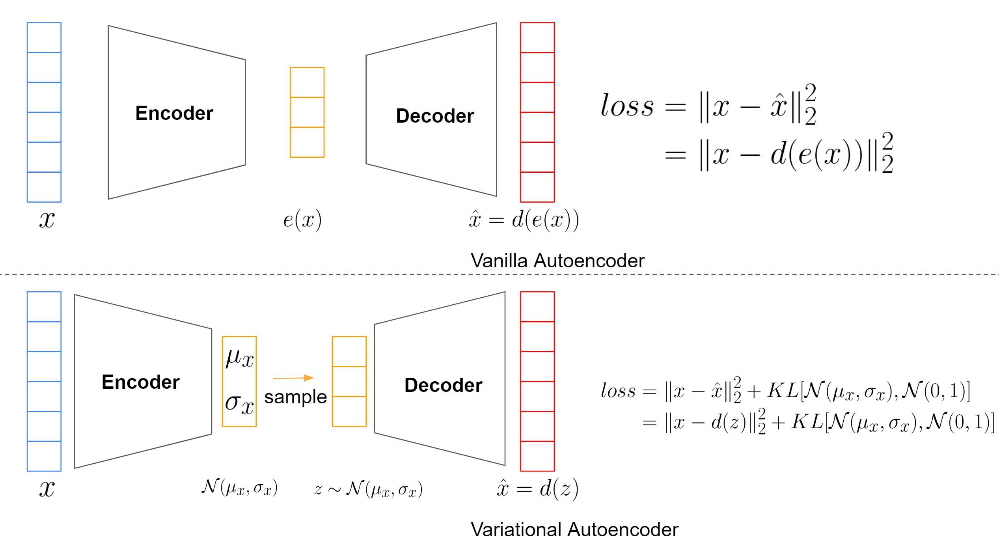
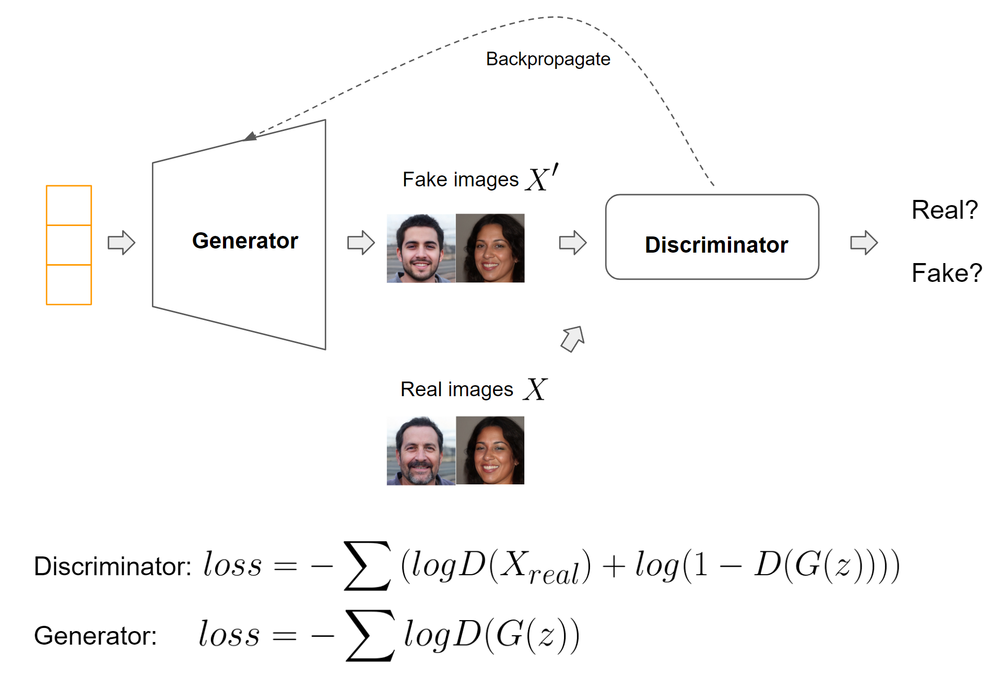
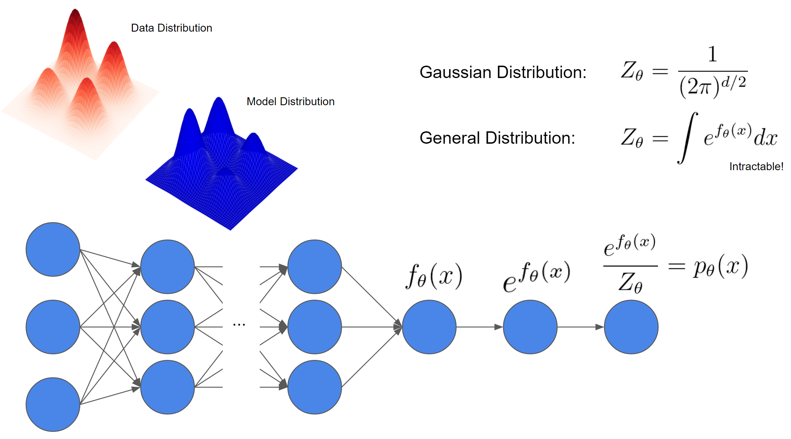
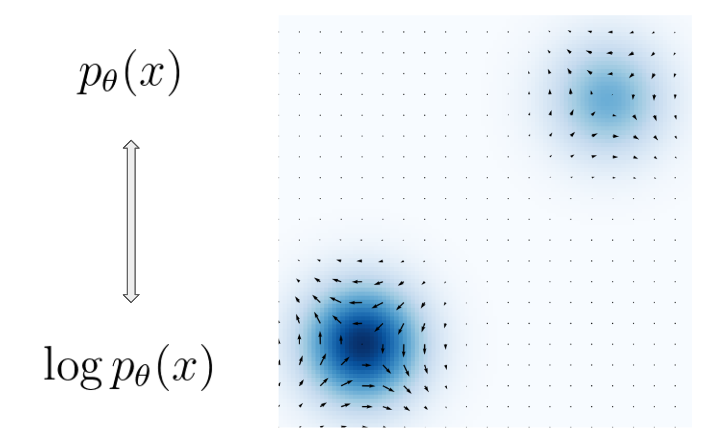
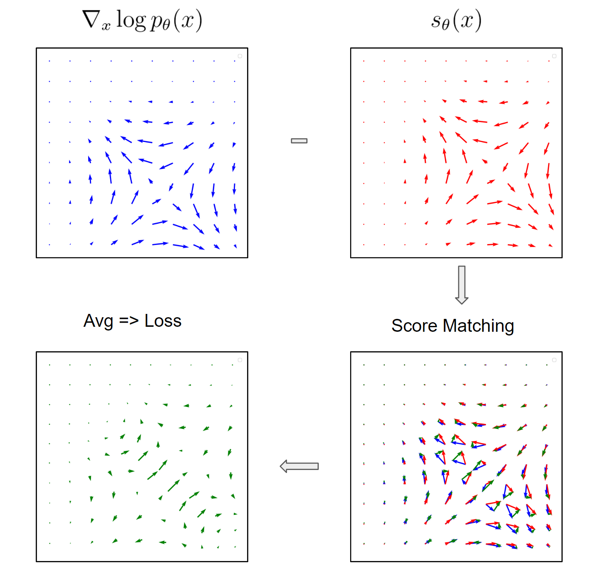

### Intro

In the continually advancing world of image generation techniques, diffusion-centric methods have seen a notable rise in interest, alongside other significant progressions. Models such as [Stable Diffusion](https://stability.ai/blog/stable-diffusion-public-release), [Imagen](https://imagen.research.google/), and DALL-E2(https://openai.com/dall-e-2) have garnered acclaim for their impressive feats. In this article, I'll demonstrate the connection between score-based generative models and these cutting-edge generative models. Our discussion will include a side-by-side review of diffusion models versus score-based generative models, illustrating the seamless integration of diffusion methods within the score-based paradigm. Moreover, I'll delve into captivating scenarios where classifiers can steer the diffusion mechanism, facilitating the creation of image examples influenced by specific class identifiers or textual cues. I utilized many of the explanations and illustrations found in [this post](https://yang-song.net/blog/2021/score/) written by the primary author of the score-based generative model paper.

### Generative Model History

In the domain of machine learning, models predominantly fall into two categories: generative and discriminative. A model that determines whether an image depicts a dog or a cat is discriminative, whereas a model that generates a lifelike image of a dog or cat is generative. Representative discriminative models encompass methods such as Logistic regression, SVM, random forest, and DNN. On the other hand, typical generative models consist of autoencoders, GANs, and diffusion models.

The underlying principle for all generative models is to transform a basic distribution, commonly a gaussian distribution, into a more intricate target distribution. This transformation simplifies the task of drawing samples from the intricate distribution to merely sampling from a gaussian distribution. As an illustration, the distribution from which our image dataset originates can serve as the target distribution. To put it more precisely, if our basic gaussian distribution is denoted as $X$, our objective is to devise a model such that $G(X)$ mirrors the distribution of our input dataset. Consequently, when we draw samples from $X$, $G(X)$ will reflect the distribution of our original data.

#### Autoencoder
Autoencoders represent an early popular generative model. They comprise two components: an encoder, which transforms input data into a latent space, and a decoder, which reverts this latent representation back to an output resembling the original input data. One can also interpret autoencoders as dimensionality reduction techniques, given that the latent space typically has significantly fewer dimensions than the input. This latent space acts as the architecture's bottleneck, ensuring only the most pertinent information is passed through and subsequently reconstructed. However, traditional autoencoders encode input data to arbitrary locations in the latent space, complicating the generation of realistic images upon decoding from sampled latent points. To address these limitations, the Variational Autoencoder (VAE) was introduced.

The VAE's innovation is its attempt to ensure encoded data within the latent space adheres to a standard normal distribution. This is accomplished by incorporating a KL-divergence between the encoded data and a standard normal distribution into the loss function. Thus, the loss consists of two components: a reconstruction loss (typically MSE, as with traditional autoencoders) and a KL-divergence loss. The resulting encoded data then aligns with a standard normal distribution. Such an approach guarantees that: 1) closely situated points in the latent space produce similar decoding outputs, and 2) any point sampled from the standard normal distribution yields meaningful decoded outputs. Nonetheless, the VAE often produces somewhat blurred results, likely due to inherent interpolations between various images.

*
Autoencoder architecture(by Pu Zhang)
*

#### GAN
Generative Adversarial Networks (GANs) are a renowned class of generative models, characterized by the interplay between two main components: the generator and the discriminator. Introduced in 2014, the generator uses random noise to produce lifelike images, while the discriminator's role is to distinguish between fake images crafted by the generator and authentic ones. The loss function for the discriminator is the BCE loss, whereas the generator's loss aims to maximize the log likelihood across all fabricated samples. For optimal image generation with GANs, both the generator and the discriminator must be proficient by the end of training. Over the past decade, GANs have demonstrated the capability to create strikingly realistic images, marking a significant milestone in deep learning. However, they come with two primary challenges: 1) the complexity of training the model, and 2) potential mode collapse issues, causing the generated images to lack diversity, meaning the model may only replicate a narrow segment of the input data distribution, rather than its entirety.

*
GAN architecture(by Pu Zhang)
*

#### Diffusion Model
The diffusion model, introduced in 2020, outperforms GAN in generating results. For an in-depth understanding of the diffusion model's functionality, please consult [my earlier article]( "Diffusion Model").

#### Score Based Generative Model

In generative modeling, the goal is to mirror the intricate distribution of authentic data. Using a deep neural network (DNN) is a prevalent strategy to achieve this. The intention is to utilize the DNN to depict a complex probability distribution $P_\theta$. Nevertheless, the DNN's output $f_\theta$ doesn't directly reflect the distribution as it might not be positive throughout. Therefore, our initial action is to exponentiate the output. Subsequently, to shape a probability distribution ranging between 0 and 1, the output is normalized by dividing with a constant $Z_\theta$. This constant in the denominator is termed the normalizing constant. In Gaussian models, determining this constant is straightforward due to the simplistic nature of $f_\theta$. However, for advanced deep neural network architectures, it becomes a challenge to compute this constant.

*
Model Normalization Challenge(by Pu Zhang)
*

The primary concept of the [score based generative modeling paper](https://arxiv.org/abs/2011.13456) revolves around score functions. This highlighted section of the illustration represents a density function alongside the score function for a combination of two Gaussian distributions. The density function is visually represented with varying shades, with a darker shade signifying a denser region. The score function, on the other hand, represents a vector field indicating the direction of the steepest increase in the density function. Given the density function, deducing the score function becomes straightforward by merely computing the derivative. In a similar vein, knowing the score function enables the retrieval of the density function, in essence, by calculating integrals. Hence, the score function and the probability distribution are interchangeable in their roles.

*
Score Function vs Probability Density(by Pu Zhang)
*

Revisiting the challenge related to the normalizing constant, it becomes evident that when the gradient of the probability function is computed, the normalization constant turns to zero because it does not rely on the variable $x$ in question.
$$
\begin{aligned}
\nabla_x \log p_\theta(x) &= \nabla_x f_\theta(x) - \nabla_x \log Z_\theta \\\
&= \nabla_x f_\theta(x) \\\
&= s_\theta(x)
\end{aligned}
$$

Instead of employing a DNN to represent $p_\theta(x)$ outright, we utilize the DNN to characterize the score function $s_\theta(x)$. The goal now shifts to contrasting two vector fields associated with score functions. Subsequently, we can determine the disparity vectors for those vector pairs. Finally, by averaging over the densities of these disparity vectors, we derive a singular scalar-valued objective. This technique is recognized as the score matching algorithm.

*
Score Matching Algorithm(by Pu Zhang)
*

---