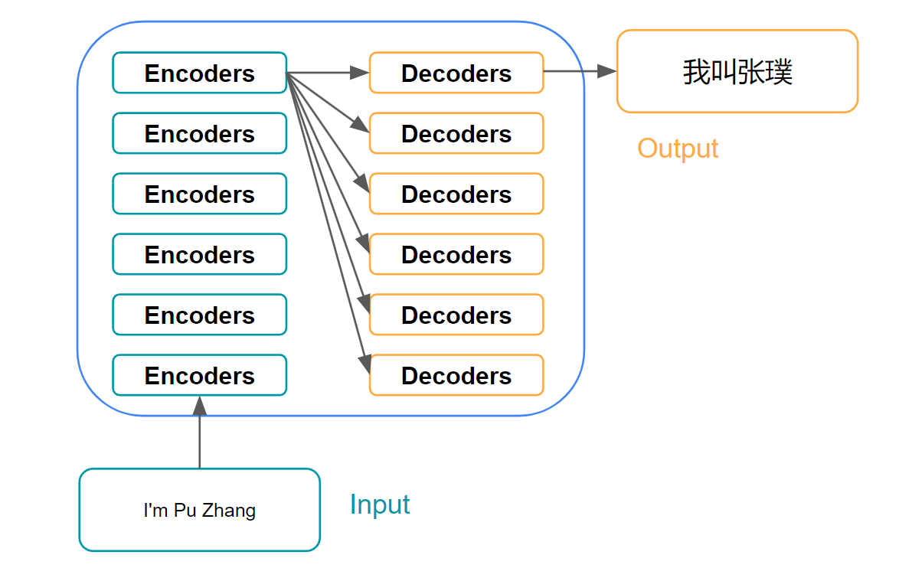
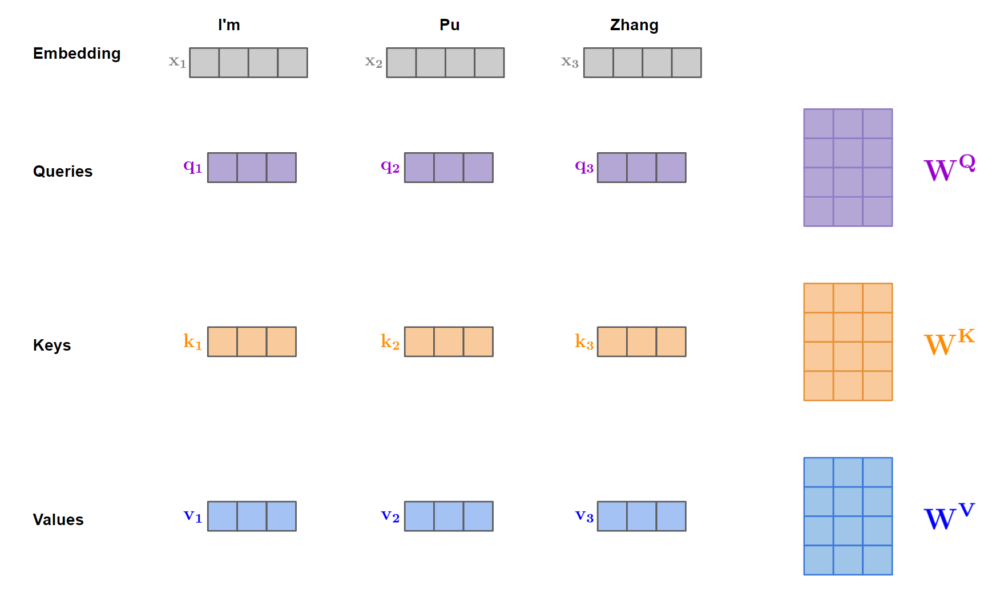
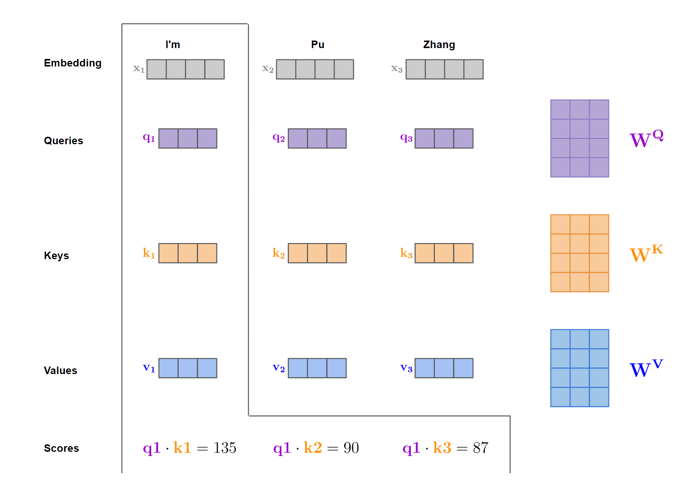
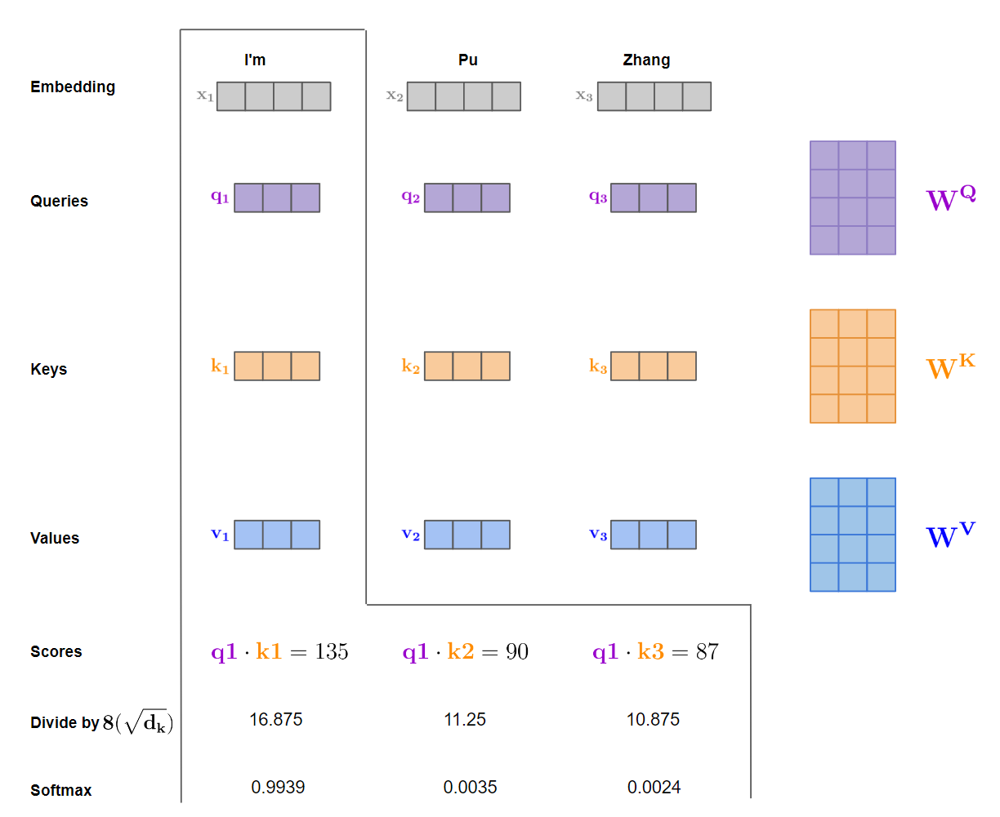
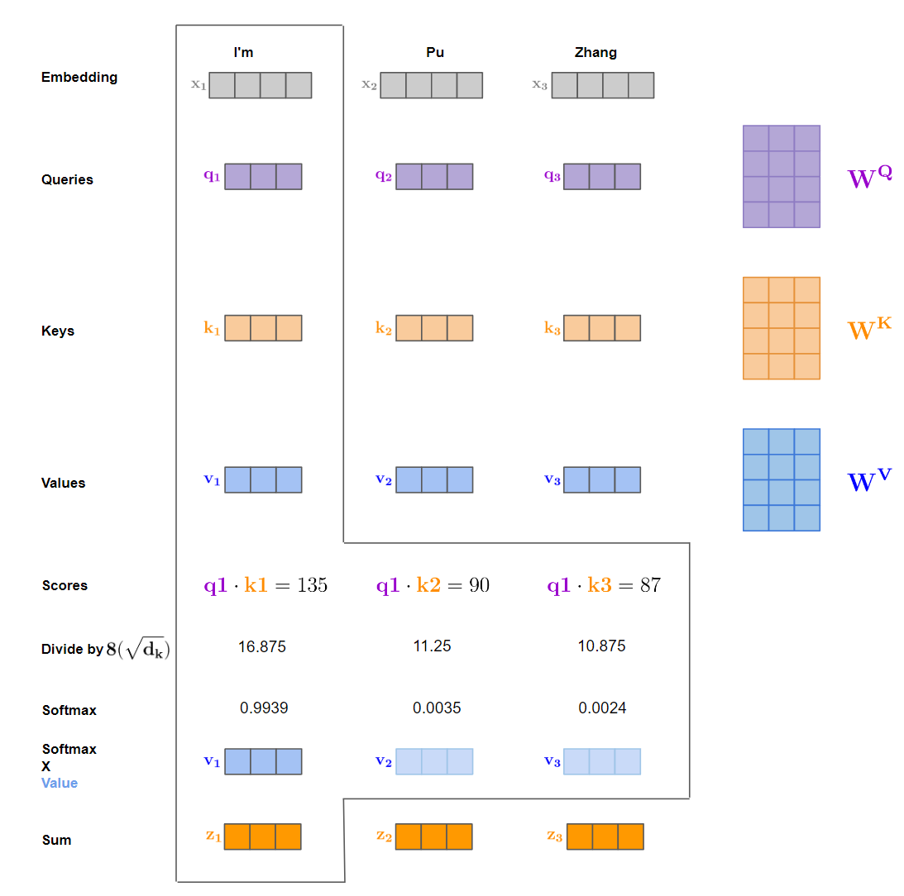
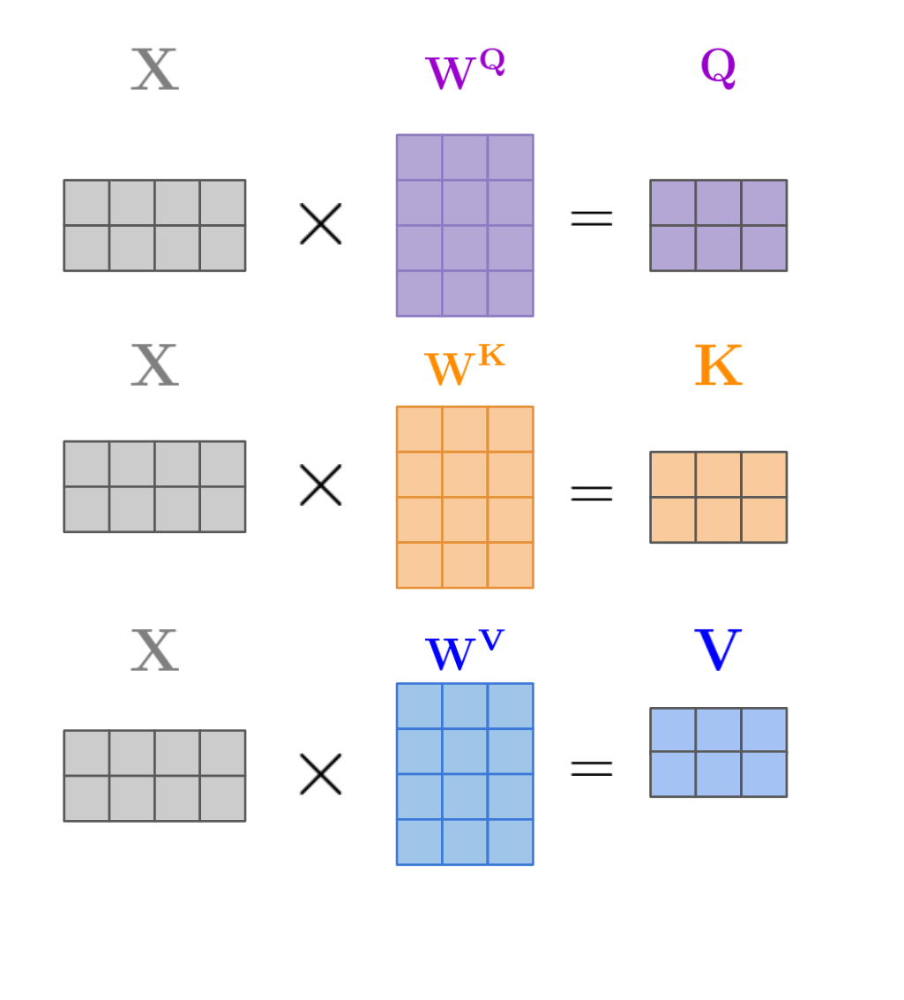
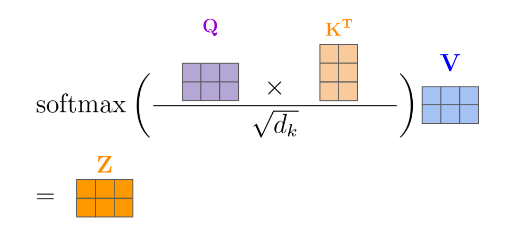
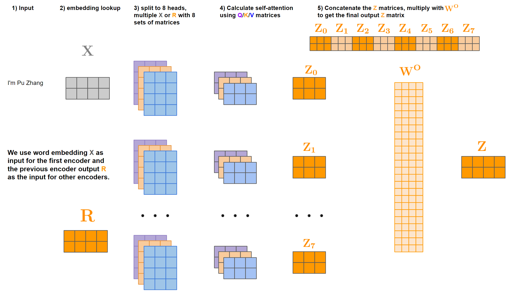
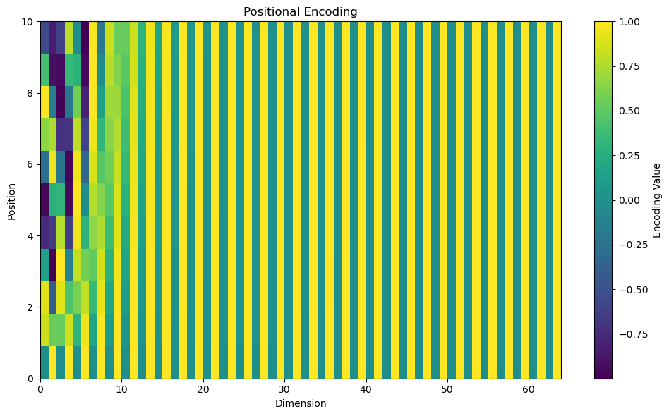
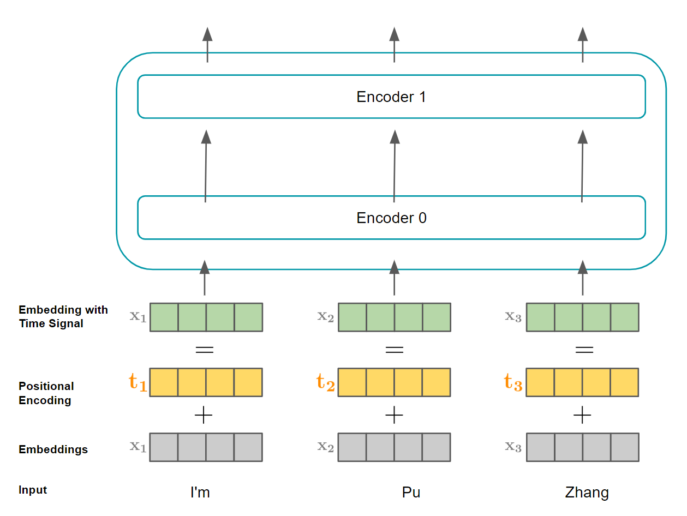

### Intro

Introduced by the famous paper [Attention is All You Need](https://arxiv.org/abs/1706.03762) in 2017, the transformer architecture has been revolutionary across the entire deep learning field. From powering state-of-art language models like OpenAI's ChatGPT and Google's BERT to applications in machine translation, text summarization and even areas outside of NLP like computer vision, the transformer has firmly established itself as a cornerstone of modern artificial intelligence research and application. I will explain the transformer's architecture in this post. Many pictures here are inspired by [Jay Alammar's this excellent post](https://jalammar.github.io/illustrated-transformer/).

### Transformer Architecture

From very level, we can treat the transformer as a black box. In the machine translation area, it takes the input sentence in one language and output the translated sentence in another language. 
*

*
*
Transformer High Level Arch(by Pu Zhang)
*

Taking a deeper look, the transformer architecure consists an encoding component and an decoding component. 

*

*
*
Transformer Arch Breakdown(by Pu Zhang)
*

The encoding component is a stack of encoders(six encoders) and the decoding component is a stack of decoders(six decoders). 

*

*
*
Transformer Arch Further Breakdown(by Pu Zhang)
*

All encoders have the same structure, which is a self-attention layer followed by feed forward layer. These encoders do not share weights.

*

*
*
Transformer Encoder Breakdown(by Pu Zhang)
*

All decoders have the same structure as well, and each decoder's structure is similar to each encoder's structure, but with one additional layer. So each decoder has a self-attention layer, followed by an encoder-decoder attention layer and then followed by an feed forward layer.

*

*
*
Transformer Decoder Breakdown(by Pu Zhang)
*

When words flows through the network, they will be transformed into word embeddings first. One key property of transformer is that each word will be processed independently, which is in contrast to recurrent architectures like LSTM or RNN where the processing of one word depends on the previous word. In the self-attention layer, each word will interfact with all other words to determine which words it should "attend to". So there is a dependency between words in this layer. But after the self-attention layer, the feed-forward layer is applied to each word's position separately, so the computations for each position in the feed-forward layer can be executed in parallel. And this is a big advantage for parallel processing on GPUs.

*

*
*
Transformer Encoder Flow(by Pu Zhang)
*

### Self-Attention Layer

Let's look at this sentence: "My cat does not want to go outside because it is lazy". As humans, it is eazy for us to know the word "it" means "my cat". But how can the transformer know the same thing? The self-attention layer basically gives the transformer this ability. 

There are three kinds of matrices used in the self-attention layer: query matrix, key matrix and value matrix. When each matrix is multiplied with the input embedding vector, we get three vectors: query vector, key vector and value vector. 

*

*
*
Self-Attention Matrices(by Pu Zhang)
*

The goal for the self-attention layer is to give each word pair a score indicating their relevance. This is done via taking the dot product of the query vector and key vector of the two words.  

*

*
*
Self-Attention Dot Product(by Pu Zhang)
*

Once we have the dot product results, we will divide the values by $\sqrt{d_k}$(the square root of the key vectors' dimension which is 64 in the original paper). This is to make the gradients more stable. These divided values will go through softmax to get the self-attention scores that will sum up to 1.

*

*
*
Self-Attention Softmax(by Pu Zhang)
*

We then use the calculated scores as weights to multiply with the value vectors and eventually compute the weighted sum as the final output for the self-attention layer.

*

*
*
Self-Attention Weighted Sum(by Pu Zhang)
*

In real applications, instead of processing the input sample-by-sample, we usually do batch processing to increase the efficiency and fully utilize the parallelism of GPUs. For batch processing, instead of working on input vectors, we will work on input matrix. And by multiplying with each of the three matrices(${\color{Orchid} \mathbf{W^Q}}, {\color{Orange} \mathbf{W^K}}, {\color{Blue} \mathbf{W^V}}$), we will get the the corresponding Query, Key and Value matrices(${\color{Orchid} \mathbf{Q}}, {\color{Orange} \mathbf{K}}, {\color{Blue} \mathbf{V}}$).

*

*
*
Self-Attention Batch Processing: Key, Query, Value matrices(by Pu Zhang)
*

Calculating the weighted sum of value matrices and eventually convert to scores using softmax is also done via matrix operations.

*

*
*
Self-Attention Batch Processing: Weighted Sum, Softmax(by Pu Zhang)
*

### Multi-Headed Attention

The idea for multi-head attention is to not only use three matrices, but 8 set of matrices where each set has its own independent Query, Key and Value matrices. Each set of matrices is randomly initialized. After training, each set of matrices are used to project the input embedding or the encoder output into a different representation space. This will result in 8 matrices, to make the output dimensions same with the single-head case, we first concatenate all $Z$ matrices together into a single matrix and then multiply it with a matrix ${\color{Orange} \mathbf{W^O}}$ to get the final output $Z$. This output will have the same dimensions as the single-head case.

*

*
*
Multi-Head Attention(by Pu Zhang)
*

### Positional Encoding

The self-attention layer introduced so far does not take word ordering into consideration and is treating the same word in different locations the same. However, word ordering clearly matters in natural languages. To address this issue, [the paper](https://arxiv.org/abs/1706.03762) introduces positional encoding. For a word in the position $pos$, its $(2i)$-th or $(2i+1)$-th dimension embedding's positional encoding is calculated as 
$$
\begin{aligned}
PE_{(pos, 2i)}&=sin(pos/10000^{2i/d_{model}}) \\\
PE_{(pos, 2i+1)}&=cost(pos/10000^{2i/d_{model}})
\end{aligned}
$$, here $d_{model}$ is the model's embedding dimensions. One example of the generated positional embedding is shown in the picture below.

*

*
*
Positional Encoding(by Pu Zhang)
*

Once the positional encoding is computed, it will be added to input words' embeddings to get the final embeddings with time signal. 

*

*
*
Positional Encoding Added to Input(by Pu Zhang)
*

---