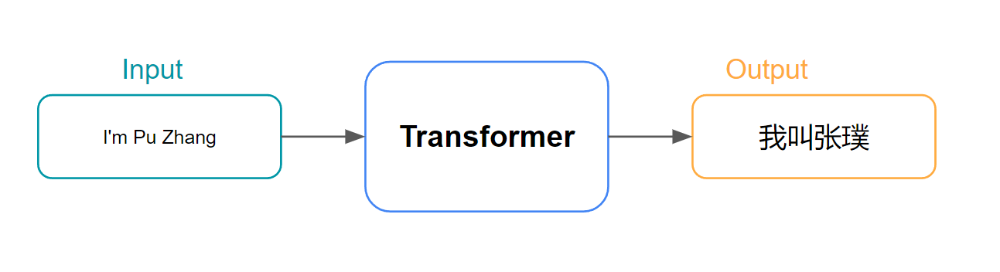
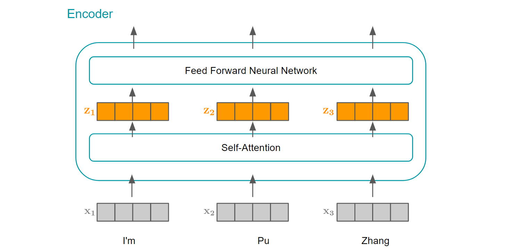

### Intro

Introduced by the famous paper [Attention is All You Need](https://arxiv.org/abs/1706.03762) in 2017, the transformer architecture has been revolutionary across the entire deep learning field. From powering state-of-art language models like OpenAI's ChatGPT and Google's BERT to applications in machine translation, text summarization and even areas outside of NLP like computer vision, the transformer has firmly established itself as a cornerstone of modern artificial intelligence research and application. I will explain the transformer's architecture in this post. Many pictures here are inspired by [Jay Alammar's this excellent post](https://jalammar.github.io/illustrated-transformer/).

### Transformer Architecture

From very level, we can treat the transformer as a black box. In the machine translation area, it takes the input sentence in one language and output the translated sentence in another language. 
*

*
*
Transformer High Level Arch(by Pu Zhang)
*

Taking a deeper look, the transformer architecure consists an encoding component and an decoding component. 

*

*
*
Transformer Arch Breakdown(by Pu Zhang)
*

The encoding component is a stack of encoders(six encoders) and the decoding component is a stack of decoders(six decoders). 

*

*
*
Transformer Arch Further Breakdown(by Pu Zhang)
*

All encoders have the same structure, which is a self-attention layer followed by feed forward layer. These encoders do not share weights.

*

*
*
Transformer Encoder Breakdown(by Pu Zhang)
*

All decoders have the same structure as well, and each decoder's structure is similar to each encoder's structure, but with one additional layer. So each decoder has a self-attention layer, followed by an encoder-decoder attention layer and then followed by an feed forward layer.

*

*
*
Transformer Decoder Breakdown(by Pu Zhang)
*

When words flows through the network, they will be transformed into word embeddings first. One key property of transformer is that each word will be processed independently, which is in contrast to recurrent architectures like LSTM or RNN where the processing of one word depends on the previous word. In the self-attention layer, each word will interfact with all other words to determine which words it should "attend to". So there is a dependency between words in this layer. But after the self-attention layer, the feed-forward layer is applied to each word's position separately, so the computations for each position in the feed-forward layer can be executed in parallel. And this is a big advantage for parallel processing on GPUs.

*

*
*
Transformer Encoder Flow(by Pu Zhang)
*