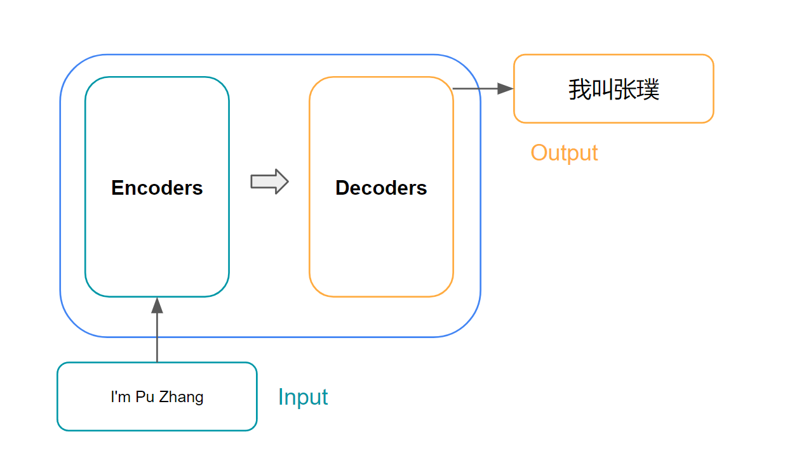

### Intro

Introduced by the famous paper [Attention is All You Need](https://arxiv.org/abs/1706.03762) in 2017, the transformer architecture has been revolutionary across the entire deep learning field. From powering state-of-art language models like OpenAI's ChatGPT and Google's BERT to applications in machine translation, text summarization and even areas outside of NLP like computer vision, the transformer has firmly established itself as a cornerstone of modern artificial intelligence research and application. I will explain the transformer's architecture in this post. Many pictures here are inspired by [Jay Alammar's this excellent post](https://jalammar.github.io/illustrated-transformer/).

### Transformer Architecture

*

*
*
Transformer High Level Arch(by Pu Zhang)
*

*

*
*
Transformer Arch Breakdown(by Pu Zhang)
*

*

*
*
Transformer Arch Further Breakdown(by Pu Zhang)
*